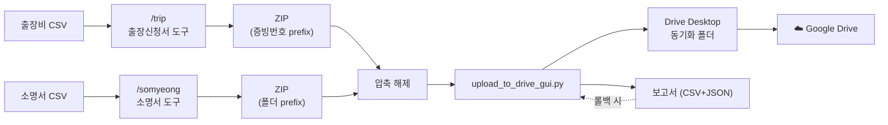
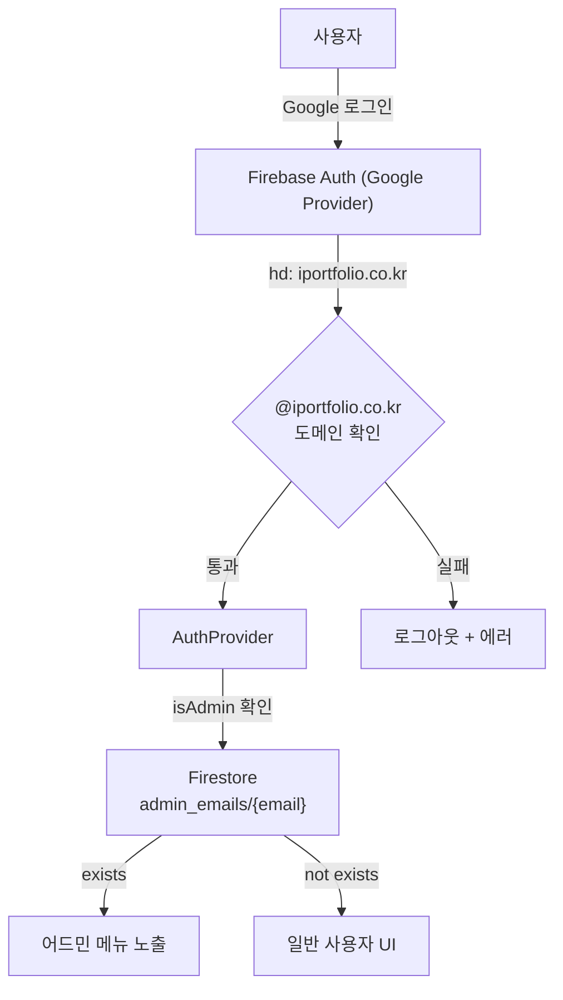
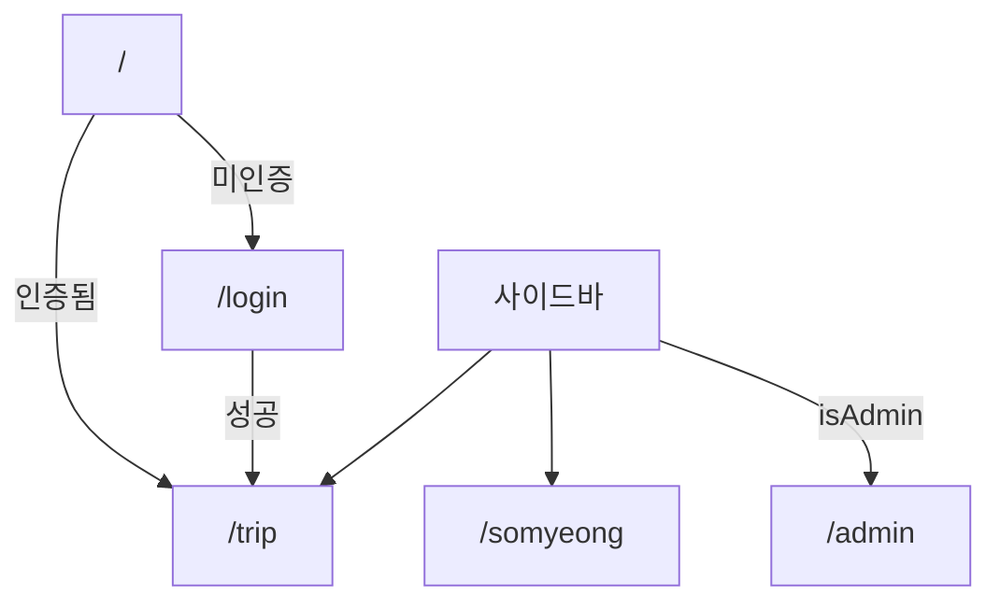
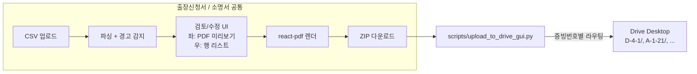

# school-team-fighting

사내 자동화 도구 모음. CSV 데이터로부터 정형 PDF 문서를 일괄 생성하고, 생성된 PDF를 Google Drive Desktop의 증빙번호 폴더로 자동 정리합니다.

**자동화 도구 (3개):**

| 도구 | 위치 | 입력 | 출력 |
|---|---|---|---|
| 출장신청서 | 웹 `/trip` | D-4 출장비 CSV | 출장신청서 PDF (ZIP) |
| 소명서 | 웹 `/somyeong` | 세부비목별 소명서 CSV | 소명서 PDF (ZIP) |
| Drive 정리 | Python (CLI/GUI) | 위에서 만든 PDF + Drive 경로 | 증빙번호별 폴더로 이동·복사 + 결과 보고서 (롤백 가능) |

---

## 주요 기능

### 출장신청서 (`/trip`)

| 기능 | 설명 |
|------|------|
| CSV → PDF 자동 변환 | D-4 출장비 시트(CSV)를 올리면 출장신청서 PDF를 한꺼번에 생성 |
| 결재 서명 자동 배치 | 결재자 서명 이미지를 PDF 결재란에 삽입. 업로드 시 흰 배경 자동 투명화 + 수동 크롭 |
| 그룹별 PDF 로고 | iPF / 디미교연 그룹별 로고를 PDF 상단에 표시. 크기·여백·위치 조절 |
| 기안자 손글씨 서명 | 거래처 첫 번째 이름을 한글 폰트로 기안란에 표시 |
| 결재 그룹 자동 감지 | CSV 파일명 또는 집행기관명에서 iPF / 디미교연 자동 인식 |
| 행별 수정·삭제 | 파싱 결과를 행 단위로 수정·삭제 후 PDF에 즉시 반영 |
| PDF 미리보기 | 검토 단계에서 좌측 PDF iframe + 우측 행 리스트 |
| 누락 데이터 빨간 표시 | 빈 필드를 PDF에 빨간 글씨로 강조해 담당자가 누락을 즉시 식별 |
| **증빙번호 prefix 파일명** | `D-4-1_1. 내부결재문서_출장신청서_{출장자}_{출장지}_{시작일}.pdf` 형식. Drive 정리 도구가 이 prefix로 폴더 라우팅 |

### 소명서 (`/somyeong`)

| 기능 | 설명 |
|------|------|
| CSV → PDF 자동 변환 | 「2025_세부비목별집행내역서 - 소명서」 형식 CSV를 올리면 A4 소명서 PDF 일괄 생성 |
| 폴더 범위 확장 | 증빙폴더번호의 쉼표(`A,B,C`)·물결(`A-1-21 ~ A-1-55`) 표기를 자동 확장 → 동일 PDF가 폴더 수만큼 복제됨 |
| 소명자 정보 어드민 관리 | 성명·소속/직위·연락처·생년월일·주소·날짜·작성자·수신처를 어드민에서 한 번 저장 |
| 작성자 서명 이미지 | 어드민에서 서명 이미지 업로드 (배경 제거 + 크롭) |
| 자동 페이지 오버플로 | 상세 내용이 길면 다음 페이지로 자연스럽게 흘러감 |
| 행 검토·편집 | 양호/누락 배지, 행별 편집 다이얼로그(증빙폴더·건명·세목·세세목·상세내용·첨부서류) |
| 누락 데이터 빨간 표시 | 비어있는 모든 필드를 PDF에 빨간 글씨로 강조 |
| **세세목 + 폴더 prefix 파일명** | `{폴더}_0. 기타_소명서_{세세목}_{건명}.pdf` 형식 (`/`는 시각적으로 동일한 전각 슬래시 `／`로 보존) |

### Drive 정리 (Python, `scripts/`)

| 기능 | 설명 |
|------|------|
| **증빙번호 prefix → 폴더 자동 라우팅** | `D-4-1_파일.pdf` → Drive의 `D-4-1/` 폴더로 prefix 떼고 이동/복사 |
| **2단계 자동 탐색** | 부모(`D-4.출장비`) 또는 조부모(`(주)아이포트폴리오`)를 지정해도 동작. 트리 안에서 prefix와 일치하는 자식 폴더를 자동 탐색 |
| **GUI + CLI** | `upload_to_drive_gui.py` (tkinter) / `upload_to_drive.py` (argparse) — 코어 로직은 `_drive_lib.py`로 공유 |
| dry-run | 실제 이동 전 시뮬레이션 |
| 보고서 자동 생성 | CSV(사람용) + JSON(롤백용) 동시 출력 |
| **롤백** | 이전 작업의 JSON 보고서로 원복: move 모드는 prefix 재부착해서 원본 폴더로 복원, copy 모드는 Drive 복사본만 삭제 |
| Drive Desktop 사용 | API 인증 불필요. Drive Desktop이 동기화한 로컬 폴더에 파일을 두면 자동으로 클라우드 동기화 |

### 어드민 (공통)

| 기능 | 설명 |
|------|------|
| 2단계 탭 구조 | 1단: 출장신청서 / 소명서 / 공통 — 2단: 각 도구별 세부 설정 |
| 도구별 설정 분리 | 도구가 추가되어도 상위 탭만 늘어남 |
| 실시간 PDF 미리보기 | 두 도구 모두 좌측 PDF + 우측 컨트롤로 변경 즉시 반영 |
| Firestore 기반 영속화 | 모든 설정은 Firestore에 저장되어 사용자 간 공유 |

---

## 워크플로우



---

## 아키텍처

### 인증/권한 흐름



### 라우팅



### 도구별 데이터 흐름



---

## 어드민 탭 구조

```
[출장신청서] [소명서] [공통]
    ↓           ↓        ↓
 [서명·결재]   [정보·서명]  [어드민 사용자]
 [PDF 레이아웃] [PDF 레이아웃]
```

| 그룹 | 하위 탭 | 내용 |
|------|---------|------|
| 출장신청서 | 서명·결재 | 그룹별(iPF / 디미교연) 결재자 서명 이미지·로고·직위 라벨 |
| 출장신청서 | PDF 레이아웃 | 페이지·로고·결재란·테이블·문구·여백 등 + 실시간 미리보기 |
| 소명서 | 소명자 정보·서명 | 성명·소속·연락처·생년월일·주소·날짜·작성자·수신처 + 서명 이미지 + 세목별 N값 |
| 소명서 | PDF 레이아웃 | 제목·섹션 헤더·테이블·상세내용·첨부서류·서명 영역 + 누락 표시 + 실시간 미리보기 |
| 공통 | 어드민 사용자 | `@iportfolio.co.kr` 어드민 이메일 추가/삭제 |

---

## 파일명 규칙

### 출장신청서 PDF
```
{증빙번호}_1. 내부결재문서_출장신청서_{출장자}_{출장지}_{YYMMDD}.pdf
예: D-4-1_1. 내부결재문서_출장신청서_이영규_제주_250624.pdf
```
ZIP: `출장신청서_모음_{YYYY-MM-DD}_{HH}시{mm}분.zip` (KST)

### 소명서 PDF
```
{폴더}_0. 기타_소명서_{세세목}_{건명}.pdf
예: D-4-1_0. 기타_소명서_장비／시설임차비_웨일북 대여비용 정산 지연.pdf
```
- `0`은 세목별 N값 (어드민 설정, 현재 모두 0)
- `／`는 전각 슬래시 (`/` 대신, 파일시스템 안전)
- ZIP: `소명서_모음_{YYYY-MM-DD}_{HH}시{mm}분.zip`

### 누락 처리
모든 필드는 비었을 때 `UNKNOWN` 또는 어드민 설정 대체 문구로 채워짐.

---

## Drive 정리 도구 사용법

### 사전 준비
```bash
# Tk (macOS Homebrew Python의 경우)
brew install python-tk@3.12

# tqdm (CLI 진행률, 선택)
pip3 install --user --break-system-packages tqdm

# Drive Desktop 동기화 활성화
# https://www.google.com/drive/download/
```

### GUI (권장)
```bash
python3 scripts/upload_to_drive_gui.py
```
- **📁 정리 탭**: PDF 폴더 + Drive 폴더 선택 → 모드(이동/복사) 선택 → 실행. 진행률·로그·결과 요약 표시
- **↩️ 롤백 탭**: 이전 작업의 `upload_report_*.json` 선택 → 원복 실행

### CLI
```bash
# 정리 (dry-run으로 먼저 확인)
python3 scripts/upload_to_drive.py organize \
  --src ~/Downloads/출장신청서_모음 \
  --drive "~/Library/CloudStorage/GoogleDrive-<email>/.../D-4.출장비" \
  --dry-run

# 실제 실행
python3 scripts/upload_to_drive.py organize --src <폴더> --drive <Drive경로>

# 롤백
python3 scripts/upload_to_drive.py rollback --json <폴더>/upload_report_<ts>.json
```

상세 사용법: [scripts/README_upload.md](scripts/README_upload.md)

---

## 기술 스택

| 영역 | 기술 |
|------|------|
| 프레임워크 | Next.js 16 (App Router, Turbopack) |
| 언어 | TypeScript 5 (strict) |
| UI | React 19, Tailwind CSS 4, shadcn/ui (`@base-ui/react`) |
| PDF 생성 | @react-pdf/renderer |
| CSV 파싱 | PapaParse |
| 파일 압축 | JSZip |
| 이미지 편집 | Canvas API + react-image-crop |
| 인증/DB | Firebase Auth (Google), Firestore |
| 토스트·아이콘 | Sonner, Lucide React |
| 정리 스크립트 | Python 3.9+ (tkinter, stdlib + tqdm) |
| 배포 | Vercel |

---

## 프로젝트 구조

```
src/
├── app/
│   ├── layout.tsx
│   ├── globals.css
│   ├── login/page.tsx
│   └── (app)/
│       ├── layout.tsx              # LoginGate + AppShell
│       ├── trip/page.tsx           # 출장신청서
│       ├── somyeong/page.tsx       # 소명서
│       └── admin/page.tsx          # 어드민 (2단계 탭)
│
├── components/
│   ├── trip-tool.tsx               # 출장신청서 메인 컴포넌트
│   ├── somyeong-tool.tsx           # 소명서 메인 컴포넌트
│   ├── pdf/
│   │   ├── business-trip-document.tsx   # 출장신청서 PDF 템플릿
│   │   └── somyeong-document.tsx        # 소명서 PDF 템플릿
│   ├── app-shell.tsx, sidebar.tsx, auth-provider.tsx, login-gate.tsx
│   └── ui/                         # shadcn 컴포넌트
│
└── lib/
    ├── csv/
    │   ├── parseD4.ts              # 출장비 CSV 파서 (evidenceNo 추출 포함)
    │   └── parseSomyeong.ts        # 소명서 CSV 파서 (폴더 범위 확장)
    ├── approval/labels.ts          # 결재 그룹 감지 (iPF / 디미교연)
    ├── names/parseName.ts          # 이름 추출 알고리즘
    ├── pdf/
    │   ├── register-pdf-fonts.ts
    │   └── group-logos.ts          # 그룹별 로고 src 해석
    ├── image/remove-bg.ts          # 서명 배경 제거 + 크롭
    ├── firebase/
    │   ├── config.ts, auth.ts
    │   └── firestore.ts            # 모든 설정 CRUD + 타입 정의
    └── utils.ts

scripts/
├── _drive_lib.py                   # 코어 로직 (process_one, find_target_folder, rollback)
├── upload_to_drive.py              # CLI (organize / rollback 하위명령)
├── upload_to_drive_gui.py          # tkinter GUI (정리 / 롤백 탭)
├── README_upload.md                # 정리 스크립트 사용법
└── test-pdf-visual.tsx             # PDF 시각 테스트
```

---

## Firestore 데이터 모델

| 문서/컬렉션 | 용도 |
|---|---|
| `admin_emails/{email}` | 어드민 권한 부여 (문서 ID = 이메일) |
| `settings/approval` | 출장신청서 — 그룹별 결재자 서명·로고·직위 |
| `settings/pdfLayout` | 출장신청서 — PDF 레이아웃 토큰 |
| `settings/somyeong` | 소명서 — 소명자 정보, 서명, 세목별 N값 |
| `settings/somyeongLayout` | 소명서 — PDF 레이아웃 토큰 |

모든 `settings/*` 문서는 deepMerge되어 코드 내 기본값과 합쳐집니다 (스키마 진화 대응).

---

## 시작하기

### 사전 준비
- **Node.js 20+**
- **Python 3.9+** (Drive 정리 스크립트용, Tk 포함 권장)
- Firebase 프로젝트 (Authentication + Firestore)

### 설치
```bash
npm install
```

### 환경 변수
`.env.local.example` → `.env.local` 복사 후:
```
NEXT_PUBLIC_FIREBASE_API_KEY=...
NEXT_PUBLIC_FIREBASE_PROJECT_ID=...
```

### Firebase 초기 설정
1. [Firebase Console](https://console.firebase.google.com)에서 Authentication → Google 로그인 활성화
2. Firestore 데이터베이스 생성
3. `admin_emails` 컬렉션에 시드 어드민 추가:
   - 문서 ID: `your-email@iportfolio.co.kr`
   - 필드: `email`, `addedBy: "seed"`
4. Firestore Security Rules로 `admin_emails` / `settings/*` 쓰기를 어드민으로 제한

### 개발 서버
```bash
npm run dev
```
http://localhost:3000

### 빌드
```bash
npm run build
```

### PDF 시각 테스트
```bash
npm run test:pdf
```

---

## 사용 시나리오

### 시나리오 A: 출장신청서 한 사이클
1. `/trip` 진입
2. **자료**: D-4 출장비 CSV 업로드 — 어드민이 등록한 그룹별 서명 자동 사용
3. **검토**: 누락 행 빨간 배지로 즉시 식별, 인라인 편집·삭제, PDF 미리보기로 확인
4. **결과**: ZIP 다운로드 → 압축 해제
5. `python3 scripts/upload_to_drive_gui.py` → PDF 폴더 + Drive 부모/조부모 선택 → dry-run 검토 → 실제 실행
6. Drive Desktop이 클라우드로 동기화

### 시나리오 B: 잘못 올렸을 때
1. GUI의 **롤백 탭** → 직전 작업의 `upload_report_*.json` 선택
2. **원복 실행** → Drive에 들어간 파일이 prefix를 다시 달고 원래 폴더로 복귀

### 시나리오 C: 새 도구 추가
1. `src/lib/csv/parseXxx.ts` (파서) + `src/components/pdf/xxx-document.tsx` (PDF) + `src/components/xxx-tool.tsx` (UI) + `src/app/(app)/xxx/page.tsx` (라우트)
2. 사이드바 NAV_ITEMS에 항목 추가
3. 어드민 1단계 탭에 그룹 추가 + 2단계 sub-tab 구성
4. 파일명에 `{폴더prefix}_` 규칙을 따르면 기존 Drive 정리 도구를 그대로 재사용 가능

---

## 배포

Vercel 연결 + 환경 변수 2개(`NEXT_PUBLIC_FIREBASE_API_KEY`, `NEXT_PUBLIC_FIREBASE_PROJECT_ID`) 설정. Drive 정리 스크립트는 클라이언트 로컬에서 실행되므로 별도 배포 불필요.

---

## 보안 메모
- 모든 Firebase 호출은 클라이언트 SDK. **Firestore Security Rules** 필수
- Drive 정리 스크립트는 **로컬에서만 동작** — Drive Desktop이 동기화한 본인 권한의 폴더만 접근. API 키·OAuth 토큰 사용 안 함
- 어드민 권한은 Firestore `admin_emails` 컬렉션 멤버십으로 결정. 본인 자신은 삭제 불가
