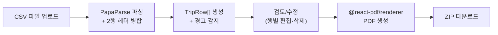
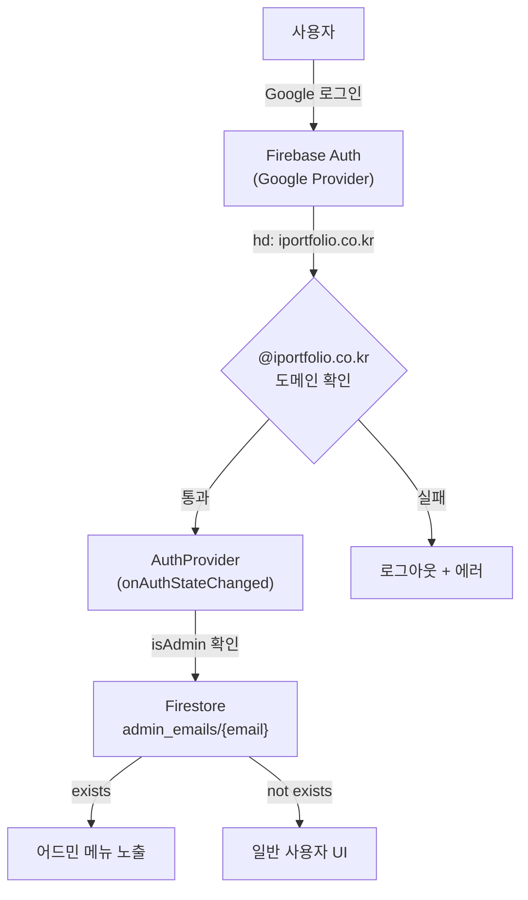
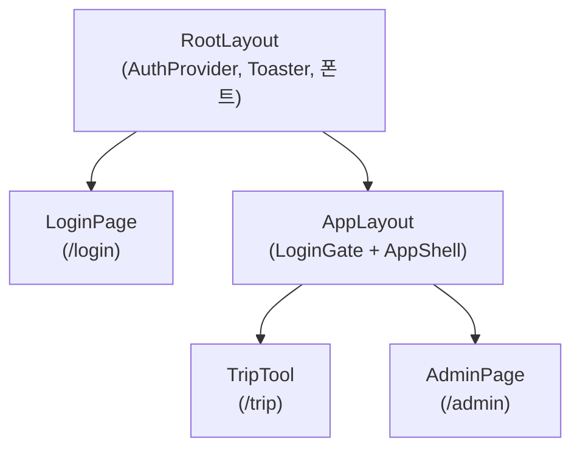
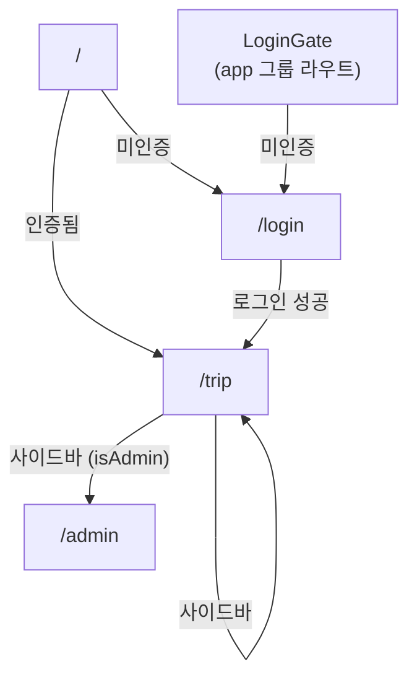

# school-team-fighting

D-4 출장비 CSV를 업로드하면 출장신청서 PDF를 자동으로 만들어 주는 사내 도구입니다.
반복적인 수작업(CSV 행마다 신청서 작성, 결재 서명·로고 배치)을 제거하고, 결재 그룹 감지부터 서명 삽입까지 한번에 처리합니다.

---

## 주요 기능

| 기능 | 설명 |
|------|------|
| CSV → PDF 자동 변환 | D-4 출장비 시트(CSV)를 올리면 출장신청서 PDF를 한꺼번에 생성 |
| 결재 서명 자동 배치 | 결재자 서명 이미지(PNG/JPG)를 PDF 결재란에 삽입. 업로드 시 흰 배경 자동 투명화 + 수동 크롭 |
| 그룹별 PDF 로고 | iPF / 디미교연 그룹별 로고 이미지를 어드민에서 업로드. PDF 상단(제목 왼쪽)에 표시. 크기·여백·좌우·상하 위치는 PDF 레이아웃에서 조절 |
| 기안자 손글씨 서명 | 거래처 첫 번째 이름을 선택된 폰트(Pretendard / Noto Sans KR / Spoqa Han Sans Neo)로 기안란에 표시 |
| 두 가지 생성 모드 | **미리보기** (행별 확인 후 ZIP 다운로드) / **바로 생성** (ZIP 한 개) |
| 결재 그룹 자동 감지 | CSV 파일명 또는 집행기관명에서 iPF / 디미교연 그룹을 자동 인식 |
| 행별 수정/삭제 | 파싱 결과를 행 단위로 수정 · 삭제 후 PDF에 즉시 반영 |
| PDF 레이아웃 커스터마이징 | 폰트, 크기, 여백, 테이블 치수, 색상, 로고, 누락 데이터 표시 등 다수 항목을 어드민에서 조정. 목 데이터 기반 실시간 PDF 미리보기 |
| 어드민 설정 | 서명·로고 정책, 결재자 직위, PDF 레이아웃, 관리자 이메일을 Firebase에서 관리 |

---

## 아키텍처

### 데이터 흐름



### 인증/권한 흐름



### 컴포넌트 계층



### 라우팅 구조



---

## 기능별 상세 로직

### 1. CSV 파싱 엔진

**파일:** `src/lib/csv/parseD4.ts`

D-4 출장비 시트 CSV를 파싱하여 `TripRow[]`로 변환합니다.

**처리 단계:**

1. **PapaParse로 원시 파싱** — `Papa.parse(fileText, { skipEmptyLines: false })`로 2차원 문자열 배열 생성
2. **헤더 행 탐색** — 첫 25행 내에서 `"사용일자"` 키워드가 포함된 행을 찾음
3. **2행 병합 헤더** — `buildMergedHeaderKeys(topRow, subRow)`로 상행+하행 헤더를 병합. `"지출금액"` 아래에 `"공급가액"`, `"부가세"`, `"합계금액"` 등의 서브컬럼이 있는 구조를 처리
4. **데이터 행 판별** — `isDataRow(row)`: 날짜 패턴(ISO/한국식), 한글 2자 이상 셀, `D-4` 키워드 등으로 실제 데이터 행 필터링
5. **날짜 정규화** — `normalizeUsageDate(raw, datePh)` (어드민 PDF 누락 데이터 문구와 연동):
   - ISO(`2025-07-05`) 등 단일 날짜 → `2025. 7. 5 ~ 2025. 7. 5` (당일 출장으로 동일 시작·종료)
   - 범위(`~`) 있으면 시작·종료를 각각 한국식으로 정규화
   - 파싱 실패 시 `dateInvalid` 문구 및 색상 사용
6. **경고 시스템** — 이름, 출장 목적, 출장지, 집행기관명, 날짜가 누락되면 `fieldWarnings` 배열에 경고 추가 → UI에서 "누락" 뱃지로 표시

**핵심 타입 (`TripRow`):**

```typescript
type TripRow = {
  rowIndex: number;
  usageDate: string;        // 원본 사용일자
  partnerRaw: string;       // 거래처 원본
  orgName: string;          // 집행기관명
  outPlace: string;         // 출장지
  writerName: string;       // 추출된 작성자 이름
  nameSource: "georae" | "detail" | "none";
  drafter3: string;         // 기안란 서명 (최대 3자)
  memberText: string;       // 출장 인원
  periodText: string;       // 출장 기간 (정규화)
  purposeText: string;      // 출장 목적
  orgGroup: "ipf" | "dimi" | "unknown";
  approver1: string;        // 결재자 1 직위
  approver2: string;        // 결재자 2 직위
  hasEmpty: boolean;         // 누락 필드 존재 여부
  fieldWarnings: string[];   // 경고 목록
  approvalGroupOverride: ApprovalGroup | "auto";
};
```

### 2. 이름 추출 알고리즘

**파일:** `src/lib/names/parseName.ts`

CSV에서 작성자 이름을 자동으로 추출하는 2단계 로직:

| 순서 | 소스 | 로직 |
|------|------|------|
| 1순위 | 거래처 셀 | 첫 줄을 `,` `/` `·` 등으로 분할 후 첫 토큰 추출. 날짜/금액 패턴은 제외 |
| 2순위 | 사용내역(수령인) 셀 | `1. 출장자명(이름)` 정규식으로 괄호 안의 이름 매칭 |

추출된 이름은 `drafterSignatureGraphemes(name, 3)`으로 최대 3자를 잘라 PDF 기안란에 표시합니다.

### 3. 결재 그룹 감지

**파일:** `src/lib/approval/labels.ts`

CSV의 집행기관명 또는 파일명에서 조직 그룹을 자동 감지합니다.

**감지 규칙:**

| 그룹 | 키워드 매칭 | 결재자 1 | 결재자 2 |
|------|------------|----------|----------|
| iPF | `아이포트`, `아이포트폴리오`, `아포폴`, `iportfolio`, `ipf`, `아이포` | 팀장 | 본부장 |
| 디미교연 | `디미`, `디미교연`, `dimi`, `디지털미디어교육콘텐츠`, `교사연구협회` | 사무국장 | 대표이사 |
| unknown | 매칭 없음 | 결재1 | 결재2 |

**감지 우선순위:**
1. 사용자가 수동 선택한 그룹 (override)
2. CSV 파일명에서 감지 (`detectGroupFromFilename`)
3. 각 행의 집행기관명에서 자동 감지 (`detectApprovalGroup`)

### 4. PDF 생성

**파일:** `src/components/pdf/business-trip-document.tsx`

`@react-pdf/renderer`로 A4 출장신청서 PDF를 생성합니다.

**상단 레이아웃:** 로고(설정 시) + 제목「출장신청서」+ 결재란이 한 행(`topBar`)에 배치됩니다.

```
┌─────────────────────────────────────────────────────┐
│ [로고] 출장신청서              ┌──────────┐          │
│                                │ 결  기안자│          │
│                                │ 재  결재1 │          │
│                                │     결재2 │          │
│                                └──────────┘          │
├─────────────────────────────────────────────────────┤
│  작성자 소속  │  (집행기관명)                        │
│  작성자 성명  │  (이름)                              │
├─────────────────────────────────────────────────────┤
│        아래와 같이 출장을 신청합니다.                │
├─────────────────────────────────────────────────────┤
│  출장 인원    │  (인원)                              │
│  출장 기간    │  (기간)                              │
│  출 장 지     │  (출장지)                            │
│  출장 목적    │  (상세 내용)                         │
├─────────────────────────────────────────────────────┤
│              (집행기관명)                           │
└─────────────────────────────────────────────────────┘
```

**서명·로고 처리:**
- **로고:** 어드민에서 그룹별 업로드한 `logoImageUrl`(data URL). PDF 레이아웃에서 표시 on/off, 가로·세로, 우측 여백, 좌우·상하 오프셋(pt) 조절
- **기안자:** 이름 최대 3자를 어드민이 선택한 폰트로 표시
- **결재자 1, 2:** 사용자 업로드 이미지 > 어드민 설정 이미지 > 플레이스홀더 문구·색상 (우선순위)
- 폰트 등록: `registerPdfFonts()`로 3개 한글 고딕 폰트(Pretendard, Noto Sans KR, Spoqa Han Sans Neo)를 lazy 등록 (클라이언트 전용, SSR 안전)

### 5. 3단계 플로우 (TripTool)

**파일:** `src/components/trip-tool.tsx`

| 단계 | 이름 | 내용 |
|------|------|------|
| 1단계 | 자료 | CSV 업로드 (필수), 결재 서명 이미지 첨부 (선택), 생성 모드 선택, 결재 그룹 선택 |
| 2단계 | 검토 | 파싱 결과 테이블, 행별 수정(다이얼로그)/삭제, 경고 표시, PDF 실시간 미리보기(preview 모드) |
| 3단계 | 끝 | 생성 완료, 다시 시작 버튼 |

**두 가지 모드:**

- **미리보기 (preview):** 2단계에서 행을 선택하면 PDF를 iframe으로 미리보기. "ZIP으로 받기"로 전체 PDF를 ZIP 한 개로 다운로드
- **바로 생성 (direct):** 검토 후 "ZIP으로 받기"로 전체 PDF를 ZIP 한 개로 다운로드

**행 편집:** `RowEditDialog`에서 작성자 성명, 소속, 출장 인원, 기간, 출장지, 목적을 수정 가능. 저장 시 `drafter3` 재계산 + 경고 재평가 + PDF 미리보기 갱신.

### 6. 어드민 설정

**파일:** `src/app/(app)/admin/page.tsx`

어드민 권한이 있는 사용자만 접근 가능한 설정 페이지. 4개 탭으로 구성:

| 탭 | 내용 |
|----|------|
| 서명 정책 | 그룹별(iPF/디미교연) **로고 이미지** 업로드·교체·삭제. 결재자 서명은 업로드 시 흰 배경 자동 투명화 + 민감도 슬라이더 + 수동 크롭 다이얼로그 |
| 결재 그룹 | iPF/디미교연 각 그룹의 결재자 1, 2 직위 라벨 편집 |
| PDF 레이아웃 | PDF 출장신청서의 폰트·크기·여백·테이블·**로고(크기·위치)**·누락 데이터 문구 등 편집. 좌측에 목 데이터 기반 실시간 PDF 미리보기. 기본값 초기화 가능 |
| 어드민 사용자 | `@iportfolio.co.kr` 어드민 이메일 추가/삭제. 자기 자신은 삭제 불가 |

설정값은 Firestore `settings/approval` 및 `settings/pdfLayout` 문서에 저장되며, 출장신청서 도구에서 자동으로 불러옵니다.

#### PDF 레이아웃 편집 항목 (섹션 개요)

| 섹션 | 편집 가능 항목 |
|------|--------------|
| 페이지 | 폰트(Pretendard / Noto Sans KR / Spoqa Han Sans Neo), 기본 크기, 줄 높이, 여백(mm) |
| 로고 | 표시 on/off, 가로·세로(pt), 제목과의 우측 여백, 좌우·상하 오프셋(pt, 음수 가능) |
| 테두리 선 | 두께(pt), 색상. 선의 존재 패턴(중첩 방지)은 변경 불가 |
| 제목 영역 | 크기, 굵기, 줄 높이, 하단 간격 |
| 결재란 | 테이블 가로 폭, 칸 가로, 최소 높이, 폰트 크기, 패딩, 서명 이미지 최대 높이, 플레이스홀더 색상 |
| 데이터 테이블 | 라벨 칸 가로, 행 높이, 배경색, 텍스트 크기/굵기, 패딩 |
| 연결 문장 | 텍스트 크기, 상하 여백 |
| 출장 목적 행 | 최소 높이, 패딩, 텍스트 크기, 줄 높이 |
| 하단 기관명 | 텍스트 크기, 굵기, 상단 여백 |
| 누락 데이터 표시 | 빈 필드·날짜 누락·날짜 오류·기안자 없음·서명 없음 각각의 대체 문구와 강조 색상 |

---

## 인증/권한 시스템

### 인증 플로우

1. `@iportfolio.co.kr` Google 계정으로만 로그인 가능
2. `GoogleAuthProvider`에 `hd: "iportfolio.co.kr"` 힌트를 설정하여 계정 선택 화면 필터링
3. 로그인 후 `isAllowedDomain(email)` 재검증 — 다른 도메인이면 즉시 로그아웃 + 에러

### 권한 관리

- **AuthProvider** (`src/components/auth-provider.tsx`): `onAuthStateChanged`로 인증 상태 감지, Firestore `admin_emails` 컬렉션에서 `isAdmin` 확인
- **LoginGate** (`src/components/login-gate.tsx`): `(app)` 라우트 그룹을 감싸서 비인증 사용자를 `/login`으로 리다이렉트
- **어드민 접근**: 사이드바에서 `isAdmin`이 `true`일 때만 "어드민 설정" 메뉴 노출. 어드민 페이지 내부에서도 권한 재확인

### 보안

- 모든 Firebase 호출은 클라이언트 SDK로 이루어집니다. Next.js 미들웨어나 서버 액션은 사용하지 않으므로, Firestore Security Rules를 별도로 설정하여 서버 측 보안을 확보해야 합니다.

---

## Firestore 데이터 모델

### `admin_emails` 컬렉션

관리자 이메일 목록. 문서 ID가 이메일 주소입니다.

| 필드 | 타입 | 설명 |
|------|------|------|
| `email` | string | 이메일 주소 (= 문서 ID) |
| `addedAt` | timestamp | 추가 시각 (서버 타임스탬프) |
| `addedBy` | string | 추가한 관리자 이메일 |

### `settings/approval` 문서

전역 결재·로고 설정. 단일 문서입니다.

```
settings/approval
└── groups
    ├── ipf
    │   ├── approver1Label, approver2Label
    │   ├── approver1ImageUrl, approver2ImageUrl  (data URL)
    │   └── logoImageUrl  (data URL, PDF 상단 로고)
    └── dimi
        └── (동일 구조)
```

> 레거시 문서에 `approver1` / `approver2` 최상위 필드가 있을 경우, 읽기 시 groups에 자동 마이그레이션됩니다.

### `settings/pdfLayout` 문서

PDF 출장신청서의 레이아웃 디자인 토큰. 단일 문서입니다. 문서가 없으면 코드 내 `DEFAULT_PDF_LAYOUT` 기본값을 사용합니다.

```
settings/pdfLayout
├── page          (fontFamily, baseFontSize, baseLineHeight, marginMm)
├── border        (width, color)
├── logo          (enabled, width, height, marginRight, offsetX, offsetY)
├── title         (fontSize, fontWeight, lineHeight, marginBottom)
├── approval      (tableWidth, labelCol, header, sign, placeholder, signImageMaxHeight …)
├── dataTable     (labelWidth, rowMinHeight, colors, paddings, fonts …)
├── intro, purpose, footer
└── placeholders  (emptyField, dateFallback, dateInvalid, drafterEmpty, signEmpty + 각 color)
```

> 선의 존재 패턴(`borderTopWidth: 0`, `borderLeftWidth: 0` 등)은 테이블 중첩 방지를 위해 코드에서 고정되어 있으며 어드민 UI에서 변경할 수 없습니다.

---

## 기술 스택

| 영역 | 기술 |
|------|------|
| 프레임워크 | Next.js 16 (App Router, Turbopack dev) |
| 언어 | TypeScript 5 (strict) |
| UI | React 19, **Tailwind CSS 4** (`@import "tailwindcss"`), **@tailwindcss/postcss**, shadcn/ui **base-nova** (`@base-ui/react`, `components.json`) |
| PDF 생성 | @react-pdf/renderer |
| CSV 파싱 | PapaParse |
| 파일 압축 | JSZip |
| 이미지 편집 | Canvas API (배경 투명화), react-image-crop (크롭 UI) |
| 인증/DB | Firebase Auth (Google), Firestore |
| 토스트 | Sonner |
| 아이콘 | Lucide React |
| 배포 | Vercel |

---

## 프로젝트 구조

```
src/
├── app/
│   ├── layout.tsx              # 메타데이터(title: school-team-fighting), Geist Mono 변수, globals.css
│   ├── globals.css             # Tailwind v4 + tw-animate-css + shadcn/tailwind.css, @theme inline, OKLCH 토큰
│   ├── page.tsx
│   ├── login/page.tsx
│   └── (app)/
│       ├── layout.tsx          # LoginGate + AppShell
│       ├── trip/page.tsx
│       └── admin/page.tsx      # 어드민(서명·로고, 결재 그룹, PDF 레이아웃, 관리자)
│
├── components/
│   ├── trip-tool.tsx
│   ├── pdf/business-trip-document.tsx
│   ├── app-shell.tsx, sidebar.tsx, auth-provider.tsx, login-gate.tsx
│   └── ui/                     # shadcn CLI로 추가된 컴포넌트 다수 (button, dialog, switch …)
│
├── hooks/
│   └── use-mobile.ts           # (shadcn 사이드바 등에서 사용 가능)
│
└── lib/
    ├── csv/parseD4.ts
    ├── approval/labels.ts
    ├── names/parseName.ts
    ├── pdf/register-pdf-fonts.ts
    ├── image/remove-bg.ts
    ├── firebase/config.ts, auth.ts, firestore.ts
    └── utils.ts
```

### 루트·기타

```
components.json             # shadcn 설정 (tailwind.config 비움 = v4 CSS-first)
postcss.config.mjs          # @tailwindcss/postcss
public/fonts/               # Pretendard, Noto Sans KR, Spoqa Han Sans Neo (OTF/TTF)
assets/logo/                # 참고용 로고 원본(선택). 실제 PDF에는 어드민 업로드 data URL 사용
assets/signature_images/    # 기본 서명 이미지 원본 참고
scripts/test-pdf-visual.tsx
.cursor/rules/              # Cursor 규칙 (디자인 시스템 등)
```

> JS 설정용 `tailwind.config.ts`는 사용하지 않습니다. 테마는 `globals.css`의 `@theme inline`과 CSS 변수로 관리합니다.

---

## 시작하기

### 사전 준비

- **Node.js 20 이상** 권장 (Tailwind CSS v4·Next 16 빌드 환경)
- Firebase 프로젝트 (Authentication + Firestore)

### 설치

```bash
npm install
```

### 환경 변수

`.env.local.example`을 `.env.local`로 복사하고 값을 채우세요:

```
NEXT_PUBLIC_FIREBASE_API_KEY=your-api-key
NEXT_PUBLIC_FIREBASE_PROJECT_ID=your-project-id
```

이 두 값만 있으면 Auth, Firestore 모두 동작합니다. `authDomain`은 `{projectId}.firebaseapp.com`으로 자동 생성됩니다.

### Firebase 설정

1. [Firebase Console](https://console.firebase.google.com)에서 **Authentication** → Google 로그인 사용 설정
2. **Firestore** 데이터베이스 생성
3. Firestore `admin_emails` 컬렉션에 초기 관리자 문서 추가:
   - 문서 ID: `your-email@iportfolio.co.kr`
   - 필드: `email` (string), `addedBy` (string) = `"seed"`
4. Firestore 보안 규칙을 설정하여 `admin_emails`와 `settings` 컬렉션의 쓰기를 어드민 사용자로 제한

### 개발 서버

```bash
npm run dev
```

`http://localhost:3000`에서 확인하세요. Turbopack이 기본 활성화되어 있습니다.

### 빌드

```bash
npm run build
```

> 일부 환경에서 Next.js 생성 타입(`ResolvingMetadata` 등)과 타입 패키지 버전 불일치로 `next build`의 TypeScript 단계가 실패할 수 있습니다. 이 경우 Next/타입 정합성을 맞추거나 CI에서 타입 검사 정책을 조정하세요.

### PDF 시각 테스트

```bash
npm run test:pdf
```

`scripts/test-pdf-visual.tsx`를 실행하여 PDF 렌더링 결과를 PNG로 확인합니다.

---

## 사용 방법

1. `@iportfolio.co.kr` Google 계정으로 로그인
2. **1단계 — 자료:** D-4 출장비 CSV 파일 업로드, 결재 서명 이미지 첨부 (선택), 생성 모드 · 결재 그룹 선택
3. **2단계 — 검토:** 파싱된 데이터 확인, 누락 항목 점검, 행별 수정/삭제, PDF 미리보기 (미리보기 모드)
4. **3단계 — 결과:** ZIP 파일로 PDF 다운로드

---

## 배포

Vercel에 연결하고 환경 변수 2개(`NEXT_PUBLIC_FIREBASE_API_KEY`, `NEXT_PUBLIC_FIREBASE_PROJECT_ID`)를 설정하면 자동 배포됩니다.
