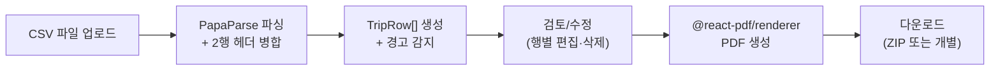
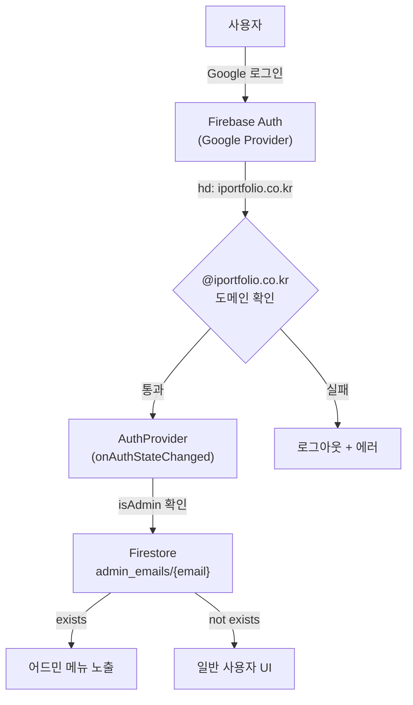
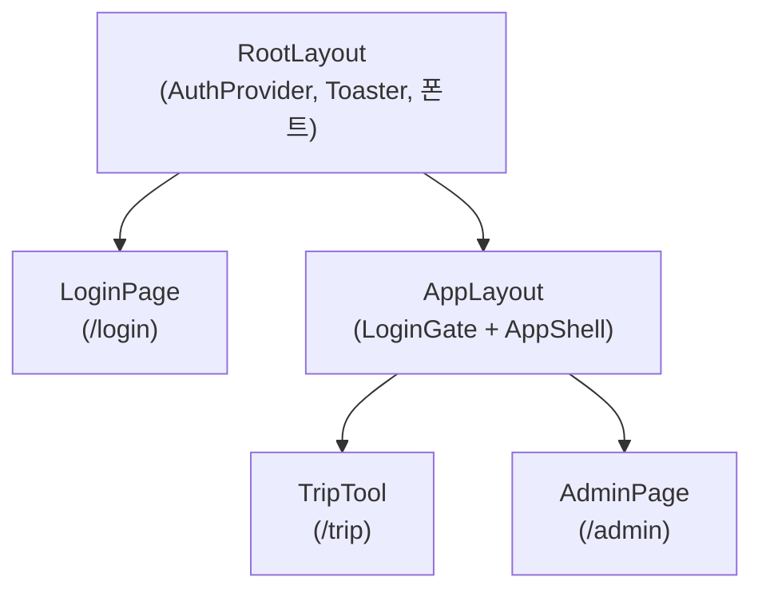
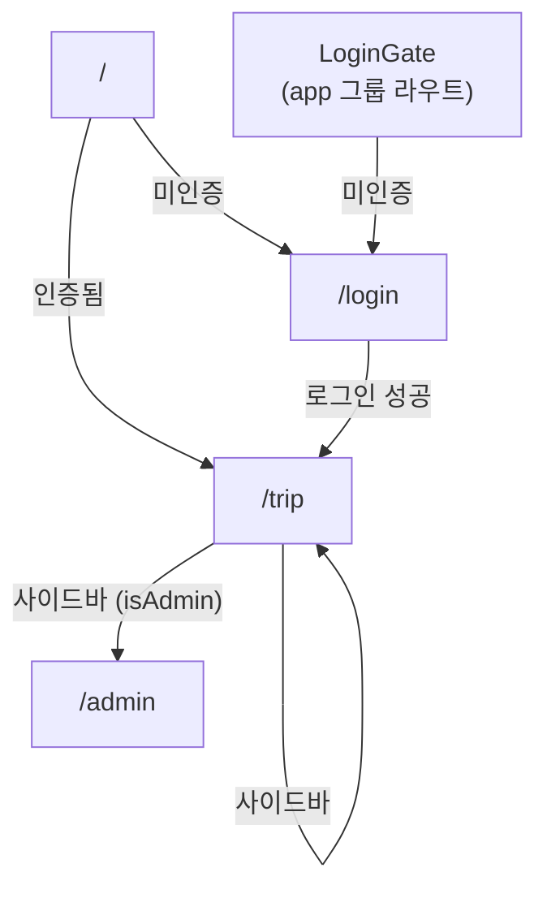

# school-team-fighting

D-4 출장비 CSV를 업로드하면 출장신청서 PDF를 자동으로 만들어 주는 사내 도구입니다.
반복적인 수작업(CSV 행마다 신청서 작성, 결재 서명 배치)을 제거하고, 결재 그룹 감지부터 서명 삽입까지 한번에 처리합니다.

---

## 주요 기능

| 기능 | 설명 |
|------|------|
| CSV → PDF 자동 변환 | D-4 출장비 시트(CSV)를 올리면 출장신청서 PDF를 한꺼번에 생성 |
| 결재 서명 자동 배치 | 결재자 서명 이미지(PNG/JPG)를 PDF 결재란에 삽입 |
| 기안자 손글씨 서명 | 거래처 첫 번째 이름을 선택된 폰트(Pretendard/Noto Sans KR/Spoqa Han Sans Neo)로 기안란에 표시 |
| 두 가지 생성 모드 | **미리보기** (행별 확인 후 개별 다운로드) / **바로 생성** (ZIP 한 개) |
| 결재 그룹 자동 감지 | CSV 파일명 또는 집행기관명에서 iPF / 디미교연 그룹을 자동 인식 |
| 행별 수정/삭제 | 파싱 결과를 행 단위로 수정 · 삭제 후 PDF에 즉시 반영 |
| PDF 레이아웃 커스터마이징 | 폰트, 크기, 여백, 테이블 치수, 색상, 누락 데이터 표시 등 40+ 항목을 어드민에서 조정 가능 |
| 어드민 설정 | 서명 정책, 결재자 직위, PDF 레이아웃, 관리자 이메일을 Firebase에서 관리 |

---

## 아키텍처

### 데이터 흐름



### 인증/권한 흐름



### 컴포넌트 계층



### 라우팅 구조



---

## 기능별 상세 로직

### 1. CSV 파싱 엔진

**파일:** `src/lib/csv/parseD4.ts`

D-4 출장비 시트 CSV를 파싱하여 `TripRow[]`로 변환합니다.

**처리 단계:**

1. **PapaParse로 원시 파싱** — `Papa.parse(fileText, { skipEmptyLines: false })`로 2차원 문자열 배열 생성
2. **헤더 행 탐색** — 첫 25행 내에서 `"사용일자"` 키워드가 포함된 행을 찾음
3. **2행 병합 헤더** — `buildMergedHeaderKeys(topRow, subRow)`로 상행+하행 헤더를 병합. `"지출금액"` 아래에 `"공급가액"`, `"부가세"`, `"합계금액"` 등의 서브컬럼이 있는 구조를 처리
4. **데이터 행 판별** — `isDataRow(row)`: 날짜 패턴(ISO/한국식), 한글 2자 이상 셀, `D-4` 키워드 등으로 실제 데이터 행 필터링
5. **날짜 정규화** — `normalizeUsageDate(raw)`:
   - ISO(`2025-07-05`) → 한국식(`2025. 7. 5`)
   - 범위(`~`) 있으면 시작~종료 유지
   - 단일 날짜면 `YYYY. MM. DD ~ YYYY. MM. DD` 형식에 종료일 미입력 표시
6. **경고 시스템** — 이름, 출장 목적, 출장지, 집행기관명, 날짜가 누락되면 `fieldWarnings` 배열에 경고 추가 → UI에서 "누락" 뱃지로 표시

**핵심 타입 (`TripRow`):**

```typescript
type TripRow = {
  rowIndex: number;
  usageDate: string;        // 원본 사용일자
  partnerRaw: string;       // 거래처 원본
  orgName: string;          // 집행기관명
  outPlace: string;         // 출장지
  writerName: string;       // 추출된 작성자 이름
  nameSource: "georae" | "detail" | "none";
  drafter3: string;         // 기안란 서명 (최대 3자)
  memberText: string;       // 출장 인원
  periodText: string;       // 출장 기간 (정규화)
  purposeText: string;      // 출장 목적
  orgGroup: "ipf" | "dimi" | "unknown";
  approver1: string;        // 결재자 1 직위
  approver2: string;        // 결재자 2 직위
  hasEmpty: boolean;         // 누락 필드 존재 여부
  fieldWarnings: string[];   // 경고 목록
  approvalGroupOverride: ApprovalGroup | "auto";
};
```

### 2. 이름 추출 알고리즘

**파일:** `src/lib/names/parseName.ts`

CSV에서 작성자 이름을 자동으로 추출하는 2단계 로직:

| 순서 | 소스 | 로직 |
|------|------|------|
| 1순위 | 거래처 셀 | 첫 줄을 `,` `/` `·` 등으로 분할 후 첫 토큰 추출. 날짜/금액 패턴은 제외 |
| 2순위 | 사용내역(수령인) 셀 | `1. 출장자명(이름)` 정규식으로 괄호 안의 이름 매칭 |

추출된 이름은 `drafterSignatureGraphemes(name, 3)`으로 최대 3자를 잘라 PDF 기안란에 표시합니다.

### 3. 결재 그룹 감지

**파일:** `src/lib/approval/labels.ts`

CSV의 집행기관명 또는 파일명에서 조직 그룹을 자동 감지합니다.

**감지 규칙:**

| 그룹 | 키워드 매칭 | 결재자 1 | 결재자 2 |
|------|------------|----------|----------|
| iPF | `아이포트`, `아이포트폴리오`, `아포폴`, `iportfolio`, `ipf`, `아이포` | 팀장 | 본부장 |
| 디미교연 | `디미`, `디미교연`, `dimi`, `디지털미디어교육콘텐츠` | 사무국장 | 대표이사 |
| unknown | 매칭 없음 | 결재1 | 결재2 |

**감지 우선순위:**
1. 사용자가 수동 선택한 그룹 (override)
2. CSV 파일명에서 감지 (`detectGroupFromFilename`)
3. 각 행의 집행기관명에서 자동 감지 (`detectApprovalGroup`)

### 4. PDF 생성

**파일:** `src/components/pdf/business-trip-document.tsx`

`@react-pdf/renderer`로 A4 출장신청서 PDF를 생성합니다.

**레이아웃 구성:**

```
┌─────────────────────────────────────────────┐
│  출장신청서                    ┌──────────┐  │
│                               │ 결  기안자│  │
│                               │ 재  결재1 │  │
│                               │     결재2 │  │
│                               └──────────┘  │
├─────────────────────────────────────────────┤
│  작성자 소속  │  (집행기관명)                │
│  작성자 성명  │  (이름)                      │
├─────────────────────────────────────────────┤
│        아래와 같이 출장을 신청합니다.        │
├─────────────────────────────────────────────┤
│  출장 인원    │  (인원)                      │
│  출장 기간    │  (기간)                      │
│  출 장 지     │  (출장지)                    │
│  출장 목적    │  (상세 내용)                 │
│               │                              │
├─────────────────────────────────────────────┤
│              (집행기관명)                     │
└─────────────────────────────────────────────┘
```

**서명 처리:**
- **기안자:** 이름 최대 3자를 어드민이 선택한 폰트로 표시
- **결재자 1, 2:** 사용자 업로드 이미지 > 어드민 설정 이미지 > `(서명)` 텍스트 (우선순위)
- 폰트 등록: `registerPdfFonts()`로 3개 한글 고딕 폰트(Pretendard, Noto Sans KR, Spoqa Han Sans Neo)를 lazy 등록 (클라이언트 전용, SSR 안전)

### 5. 3단계 플로우 (TripTool)

**파일:** `src/components/trip-tool.tsx`

| 단계 | 이름 | 내용 |
|------|------|------|
| 1단계 | 자료 | CSV 업로드 (필수), 결재 서명 이미지 첨부 (선택), 생성 모드 선택, 결재 그룹 선택 |
| 2단계 | 검토 | 파싱 결과 테이블, 행별 수정(다이얼로그)/삭제, 경고 표시, PDF 실시간 미리보기(preview 모드) |
| 3단계 | 끝 | 생성 완료, 다시 시작 버튼 |

**두 가지 모드:**

- **미리보기 (preview):** 2단계에서 행을 선택하면 PDF를 iframe으로 미리보기. "전부 PDF로" 클릭 시 행마다 개별 PDF 다운로드
- **바로 생성 (direct):** 검토 후 "ZIP으로 받기" 클릭 시 `JSZip`으로 전체 PDF를 ZIP 한 개로 다운로드

**행 편집:** `RowEditDialog`에서 작성자 성명, 소속, 출장 인원, 기간, 출장지, 목적을 수정 가능. 저장 시 `drafter3` 재계산 + 경고 재평가 + PDF 미리보기 갱신.

### 6. 어드민 설정

**파일:** `src/app/(app)/admin/page.tsx`

어드민 권한이 있는 사용자만 접근 가능한 설정 페이지. 4개 탭으로 구성:

| 탭 | 내용 |
|----|------|
| 서명 정책 | 그룹별(iPF/디미교연) 결재자 서명 이미지 업로드/교체/삭제 |
| 결재 그룹 | iPF/디미교연 각 그룹의 결재자 1, 2 직위 라벨 편집 |
| PDF 레이아웃 | PDF 출장신청서의 폰트·크기·여백·테이블 치수·색상 등 40+ 항목 편집. 기본값 초기화 가능 |
| 어드민 사용자 | `@iportfolio.co.kr` 어드민 이메일 추가/삭제. 자기 자신은 삭제 불가 |

설정값은 Firestore `settings/approval` 및 `settings/pdfLayout` 문서에 저장되며, 출장신청서 도구에서 자동으로 불러옵니다.

#### PDF 레이아웃 편집 항목 (9개 섹션)

| 섹션 | 편집 가능 항목 |
|------|--------------|
| 페이지 | 폰트(Pretendard / Noto Sans KR / Spoqa Han Sans Neo), 기본 크기, 줄 높이, 여백(mm) |
| 테두리 선 | 두께(pt), 색상. 선의 존재 패턴(중첩 방지)은 변경 불가 |
| 제목 영역 | 크기, 굵기, 줄 높이, 하단 간격 |
| 결재란 | 테이블 가로 폭, 칸 가로, 최소 높이, 폰트 크기, 패딩, 서명 이미지 최대 높이, 플레이스홀더 색상 |
| 데이터 테이블 | 라벨 칸 가로, 행 높이, 배경색, 텍스트 크기/굵기, 패딩 |
| 연결 문장 | 텍스트 크기, 상하 여백 |
| 출장 목적 행 | 최소 높이, 패딩, 텍스트 크기, 줄 높이 |
| 하단 기관명 | 텍스트 크기, 굵기, 상단 여백 |
| 누락 데이터 표시 | 빈 필드·날짜 누락·날짜 오류·기안자 없음·서명 없음 각각의 대체 문구와 강조 색상 |

---

## 인증/권한 시스템

### 인증 플로우

1. `@iportfolio.co.kr` Google 계정으로만 로그인 가능
2. `GoogleAuthProvider`에 `hd: "iportfolio.co.kr"` 힌트를 설정하여 계정 선택 화면 필터링
3. 로그인 후 `isAllowedDomain(email)` 재검증 — 다른 도메인이면 즉시 로그아웃 + 에러

### 권한 관리

- **AuthProvider** (`src/components/auth-provider.tsx`): `onAuthStateChanged`로 인증 상태 감지, Firestore `admin_emails` 컬렉션에서 `isAdmin` 확인
- **LoginGate** (`src/components/login-gate.tsx`): `(app)` 라우트 그룹을 감싸서 비인증 사용자를 `/login`으로 리다이렉트
- **어드민 접근**: 사이드바에서 `isAdmin`이 `true`일 때만 "어드민 설정" 메뉴 노출. 어드민 페이지 내부에서도 권한 재확인

### 보안

- 모든 Firebase 호출은 클라이언트 SDK로 이루어집니다. Next.js 미들웨어나 서버 액션은 사용하지 않으므로, Firestore Security Rules를 별도로 설정하여 서버 측 보안을 확보해야 합니다.

---

## Firestore 데이터 모델

### `admin_emails` 컬렉션

관리자 이메일 목록. 문서 ID가 이메일 주소입니다.

| 필드 | 타입 | 설명 |
|------|------|------|
| `email` | string | 이메일 주소 (= 문서 ID) |
| `addedAt` | timestamp | 추가 시각 (서버 타임스탬프) |
| `addedBy` | string | 추가한 관리자 이메일 |

### `settings/approval` 문서

전역 결재 설정. 단일 문서입니다.

```
settings/approval
└── groups
    ├── ipf
    │   ├── approver1Label: "팀장"
    │   ├── approver2Label: "본부장"
    │   ├── approver1ImageUrl: "" (data URL)
    │   └── approver2ImageUrl: ""
    └── dimi
        ├── approver1Label: "사무국장"
        ├── approver2Label: "대표이사"
        ├── approver1ImageUrl: ""
        └── approver2ImageUrl: ""
```

> 레거시 문서에 `approver1` / `approver2` 최상위 필드가 있을 경우, 읽기 시 groups에 자동 마이그레이션됩니다.

### `settings/pdfLayout` 문서

PDF 출장신청서의 레이아웃 디자인 토큰. 단일 문서입니다. 문서가 없으면 코드 내 `DEFAULT_PDF_LAYOUT` 기본값을 사용합니다.

```
settings/pdfLayout
├── page
│   ├── fontFamily: "Pretendard" | "NotoSansKR" | "SpoqaHanSansNeo"
│   ├── baseFontSize: 9.5
│   ├── baseLineHeight: 1.4
│   └── marginMm: 20
├── border
│   ├── width: 0.75
│   └── color: "#000000"
├── title
│   ├── fontSize: 25
│   ├── fontWeight: 700
│   ├── lineHeight: 1.15
│   └── marginBottom: 42
├── approval
│   ├── tableWidth: 256
│   ├── labelColWidth: 32
│   ├── labelColMinHeight: 60
│   ├── labelFontSize / labelCharGap
│   ├── headerMinHeight / headerFontSize / headerPaddingV / headerPaddingH
│   ├── signMinHeight / signPadding
│   ├── drafterFontSize / placeholderFontSize / placeholderColor
│   └── signImageMaxHeight: 23
├── dataTable
│   ├── labelWidth: 100
│   ├── rowMinHeight: 32
│   ├── labelBgColor: "#E6E6E6"
│   ├── labelPaddingV / labelPaddingH / labelFontSize / labelFontWeight
│   └── valuePaddingV / valuePaddingH / valueFontSize
├── intro
│   ├── fontSize: 11
│   ├── marginTop: 42
│   └── marginBottom: 42
├── purpose
│   ├── minHeight: 112
│   ├── padding: 6
│   ├── fontSize: 11
│   └── lineHeight: 1.4
├── footer
│   ├── fontSize: 15
│   ├── fontWeight: 700
│   └── marginTop: 42
└── placeholders
    ├── emptyField: "—"              # 빈 필드 대체 문구
    ├── emptyFieldColor: "#DC2626"   # 빈 필드 강조 색상
    ├── dateFallback: "YYYY. MM. DD" # 종료일 누락 시 대체
    ├── dateFallbackColor: "#DC2626"
    ├── dateInvalid: "날짜 확인 불가"  # 날짜 인식 불가 시
    ├── dateInvalidColor: "#DC2626"
    ├── drafterEmpty: "(—)"          # 기안자 서명 없음
    ├── drafterEmptyColor: "#DC2626"
    ├── signEmpty: "(서명)"           # 결재자 서명 없음
    └── signEmptyColor: "#DC2626"
```

> 선의 존재 패턴(`borderTopWidth: 0`, `borderLeftWidth: 0` 등)은 테이블 중첩 방지를 위해 코드에서 고정되어 있으며 어드민 UI에서 변경할 수 없습니다.
> 누락 데이터의 강조 색상(기본: `#DC2626` 빨강)을 통해 담당자가 수정이 필요한 항목을 PDF에서 즉시 식별할 수 있습니다.

---

## 기술 스택

| 영역 | 기술 |
|------|------|
| 프레임워크 | Next.js 16 (App Router, Turbopack dev) |
| 언어 | TypeScript 5 (strict) |
| UI | React 19, Tailwind CSS 3.4, shadcn/ui (@base-ui/react) |
| PDF 생성 | @react-pdf/renderer |
| CSV 파싱 | PapaParse |
| 파일 압축 | JSZip |
| 인증/DB | Firebase Auth (Google), Firestore |
| 토스트 | Sonner |
| 아이콘 | Lucide React |
| 배포 | Vercel |

---

## 프로젝트 구조

```
src/
├── app/                          # Next.js App Router 페이지
│   ├── layout.tsx                # 루트 레이아웃 (AuthProvider, Toaster, 폰트, 메타)
│   ├── page.tsx                  # / → 로그인 여부에 따라 /trip 또는 /login 리다이렉트
│   ├── globals.css               # 글로벌 CSS (Tailwind, CSS 변수)
│   ├── login/
│   │   └── page.tsx              # Google 로그인 페이지
│   └── (app)/                    # 인증 필요 라우트 그룹 (URL에 표시 안 됨)
│       ├── layout.tsx            # LoginGate + AppShell (사이드바)
│       ├── trip/
│       │   └── page.tsx          # 출장신청서 도구 메인
│       └── admin/
│           └── page.tsx          # 어드민 설정 (서명 정책, 결재 그룹, 관리자)
│
├── components/
│   ├── trip-tool.tsx             # 3단계 플로우: 자료 입력 → 검토 → 결과
│   ├── pdf/
│   │   └── business-trip-document.tsx  # A4 출장신청서 PDF 레이아웃 (@react-pdf)
│   ├── app-shell.tsx             # 반응형 레이아웃 (데스크톱 사이드바 + 모바일 시트)
│   ├── sidebar.tsx               # 좌측 네비게이션 (출장신청서, 어드민)
│   ├── auth-provider.tsx         # Firebase Auth Context + isAdmin 체크
│   ├── login-gate.tsx            # 비인증 사용자 → /login 리다이렉트
│   └── ui/                       # shadcn/ui 컴포넌트 (button, card, dialog 등)
│
└── lib/
    ├── csv/
    │   └── parseD4.ts            # D-4 CSV 파싱, 2행 헤더 병합, 날짜 변환, 경고 생성
    ├── approval/
    │   └── labels.ts             # 결재 그룹(iPF/디미교연) 라벨, 파일명/기관명 감지
    ├── names/
    │   └── parseName.ts          # 거래처에서 이름 추출, 기안란 서명 grapheme 처리
    ├── pdf/
    │   └── register-pdf-fonts.ts # PDF용 3개 한글 고딕 폰트 등록 (lazy, 클라이언트 전용)
    ├── firebase/
    │   ├── config.ts             # Firebase 앱 초기화 (lazy singleton, SSR 안전)
    │   ├── auth.ts               # Google 로그인/로그아웃, 도메인 검증
    │   └── firestore.ts          # 어드민 이메일 CRUD, 결재 설정 읽기/쓰기
    └── utils.ts                  # cn() (clsx + tailwind-merge)
```

### 기타 파일

```
public/fonts/               # Pretendard (6 웨이트), Noto Sans KR (6 웨이트), Spoqa Han Sans Neo (5 웨이트)
assets/signature_images/    # 기본 서명 이미지 원본 (iPF, 디미교연)
scripts/                    # test-pdf-visual.tsx (PDF 시각 테스트 스크립트)
.cursor/rules/              # Cursor AI 디자인 시스템 규칙
```

---

## 시작하기

### 사전 준비

- Node.js 18 이상
- Firebase 프로젝트 (Authentication + Firestore)

### 설치

```bash
npm install
```

### 환경 변수

`.env.local.example`을 `.env.local`로 복사하고 값을 채우세요:

```
NEXT_PUBLIC_FIREBASE_API_KEY=your-api-key
NEXT_PUBLIC_FIREBASE_PROJECT_ID=your-project-id
```

이 두 값만 있으면 Auth, Firestore 모두 동작합니다. `authDomain`은 `{projectId}.firebaseapp.com`으로 자동 생성됩니다.

### Firebase 설정

1. [Firebase Console](https://console.firebase.google.com)에서 **Authentication** → Google 로그인 사용 설정
2. **Firestore** 데이터베이스 생성
3. Firestore `admin_emails` 컬렉션에 초기 관리자 문서 추가:
   - 문서 ID: `your-email@iportfolio.co.kr`
   - 필드: `email` (string), `addedBy` (string) = `"seed"`
4. Firestore 보안 규칙을 설정하여 `admin_emails`와 `settings` 컬렉션의 쓰기를 어드민 사용자로 제한

### 개발 서버

```bash
npm run dev
```

`http://localhost:3000`에서 확인하세요. Turbopack이 기본 활성화되어 있습니다.

### 빌드

```bash
npm run build
```

### PDF 시각 테스트

```bash
npm run test:pdf
```

`scripts/test-pdf-visual.tsx`를 실행하여 PDF 렌더링 결과를 PNG로 확인합니다.

---

## 사용 방법

1. `@iportfolio.co.kr` Google 계정으로 로그인
2. **1단계 — 자료:** D-4 출장비 CSV 파일 업로드, 결재 서명 이미지 첨부 (선택), 생성 모드 · 결재 그룹 선택
3. **2단계 — 검토:** 파싱된 데이터 확인, 누락 항목 점검, 행별 수정/삭제, PDF 미리보기 (미리보기 모드)
4. **3단계 — 결과:** ZIP 또는 개별 PDF 다운로드

---

## 배포

Vercel에 연결하고 환경 변수 2개(`NEXT_PUBLIC_FIREBASE_API_KEY`, `NEXT_PUBLIC_FIREBASE_PROJECT_ID`)를 설정하면 자동 배포됩니다.
