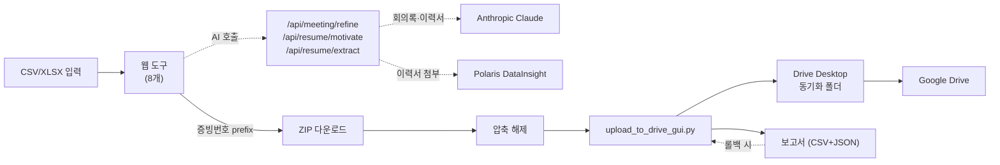
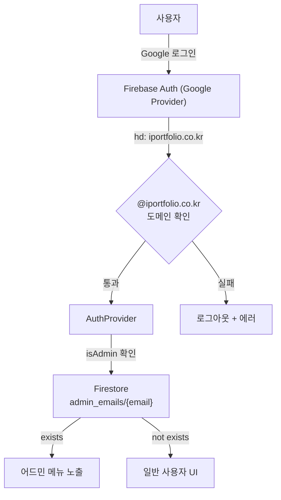
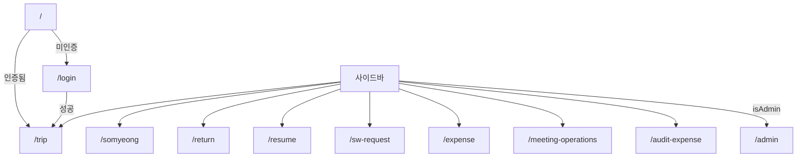

# school-team-fighting

사내 행정 자동화 도구 모음. CSV / XLSX 입력으로부터 정형 PDF 문서(출장신청서·복명서·소명서·이력서·SW 활용 요청서·지출결의서·운영회의록)를 일괄 생성하고, 생성된 PDF를 Google Drive Desktop의 증빙번호 폴더로 자동 정리합니다. 회의록·이력서에는 Anthropic Claude 기반 본문 다듬기·자기소개 작성 기능이, 집행내역서에는 자동 검증·수정 도구가 포함됩니다.

---

## 자동화 도구 한눈에

| 도구 | 위치 | 입력 | 출력 | AI |
|---|---|---|---|---|
| 출장신청서 | 웹 `/trip` | D-4 출장비 CSV (v1/v2) | 출장신청서 PDF (ZIP) | — |
| 출장복명서 | 웹 `/return` | 복명서 CSV + 첨부 사진 | 출장복명서 PDF (ZIP) | — |
| 소명서 | 웹 `/somyeong` | 세부비목별 소명서 CSV | 소명서 PDF (ZIP) | — |
| 이력서 | 웹 `/resume` | 코디네이터/강사 이력 CSV + 첨부 자료(hwp·docx·pptx·xlsx·pdf) | 이력서 PDF (ZIP) | Claude · Polaris |
| 소프트웨어 활용 요청서 | 웹 `/sw-request` | D-3 신청 CSV + 견적 워크북 + 합격자 명단 | SW 요청서 PDF (ZIP) | — |
| 지출결의서 | 웹 `/expense` | 세부비목별집행내역서 XLSX (다중 탭) | 지출결의서 PDF (ZIP) | — |
| 운영회의록 | 웹 `/meeting-operations` | D-2 운영회의록 CSV | 회의록 PDF (ZIP) | Claude |
| 집행내역서 검증 | 웹 `/audit-expense` | 세부비목별집행내역서 XLSX | 이슈 리포트 + 자동수정 워크북 | — |
| Drive 정리 | Python (CLI/GUI) | 위 도구가 만든 PDF + Drive 경로 | 증빙번호별 폴더로 이동·복사 + 보고서 (롤백 가능) | — |

> 사이드바에 노출되는 8개 웹 도구 + 1개 데스크탑 도구. 사이드바 순서도 위 표와 동일합니다.

---

## 주요 기능

### 1. 출장신청서 (`/trip`)

| 기능 | 설명 |
|------|------|
| CSV → PDF 자동 변환 | D-4 출장비 시트(CSV)를 올리면 출장신청서 PDF를 한꺼번에 생성 |
| **CSV v1·v2 동시 지원** | 신규 v2 형식 자동 감지. 어드민에서 v2 샘플 업로드 슬롯 제공 |
| 결재 서명 자동 배치 | 결재자 서명 이미지를 PDF 결재란에 삽입. 업로드 시 흰 배경 자동 투명화 + 수동 크롭 |
| 그룹별 PDF 로고 | iPF / 디미교연 그룹별 로고를 PDF 상단에 표시. 크기·여백·위치 조절 |
| 기안자 손글씨 서명 | 거래처 첫 번째 이름을 한글 폰트로 기안란에 표시 |
| 결재 그룹 자동 감지 | CSV 파일명 또는 집행기관명에서 iPF / 디미교연 자동 인식 |
| 행별 수정·삭제 | 파싱 결과를 행 단위로 수정·삭제 후 PDF에 즉시 반영 |
| PDF 미리보기 | 검토 단계에서 좌측 PDF iframe + 우측 행 리스트 |
| 누락 데이터 빨간 표시 | 빈 필드를 PDF에 빨간 글씨로 강조해 담당자가 누락을 즉시 식별 |

### 2. 출장복명서 (`/return`)

| 기능 | 설명 |
|------|------|
| CSV → PDF 자동 변환 | 복명서 CSV를 올리면 행별 복명서 PDF 생성 |
| 사진 첨부 | 출장 사진을 행별로 업로드, PDF 그리드에 자동 배치 (행당 최대치 어드민 설정) |
| 같은 결재 시스템 사용 | 출장신청서와 동일한 그룹별 결재자 / 로고 설정 공유 |
| 누락 데이터 빨간 표시 | 출장신청서와 동일한 정책 |

### 3. 소명서 (`/somyeong`)

| 기능 | 설명 |
|------|------|
| CSV → PDF 자동 변환 | 「2025_세부비목별집행내역서 - 소명서」 형식 CSV를 올리면 A4 소명서 PDF 일괄 생성 |
| 폴더 범위 확장 | 증빙폴더번호의 쉼표(`A,B,C`)·물결(`A-1-21 ~ A-1-55`) 표기를 자동 확장 → 동일 PDF가 폴더 수만큼 복제 |
| 소명자 정보 어드민 관리 | 성명·소속/직위·연락처·생년월일·주소·날짜·작성자·수신처를 어드민에서 한 번 저장 |
| 작성자 서명 이미지 | 어드민에서 서명 이미지 업로드 (배경 제거 + 크롭) |
| 자동 페이지 오버플로 | 상세 내용이 길면 다음 페이지로 자연스럽게 흘러감 |
| 행 검토·편집 | 양호/누락 배지, 행별 편집 다이얼로그(증빙폴더·건명·세목·세세목·상세내용·첨부서류) |
| 누락 데이터 빨간 표시 | 비어있는 모든 필드를 PDF에 빨간 글씨로 강조 |

### 4. 이력서 (`/resume`)

| 기능 | 설명 |
|------|------|
| CSV → PDF 자동 변환 | 코디네이터·강사 두 가지 양식 지원 (별도 PDF 템플릿) |
| **AI 자기소개 작성** | 첨부 자료 텍스트 + 행 데이터를 컨텍스트로 Claude 가 「지원 동기 및 포부」 자동 작성 |
| **첨부 자료 텍스트 추출** | hwp / hwpx / docx / pptx / xlsx / pdf → Polaris DataInsight API 로 본문 추출 후 AI 컨텍스트에 투입 |
| Vercel Blob 업로드 | 4MB 초과 자료는 클라이언트 → Blob 직접 업로드(서버리스 함수 body 제한 우회) |
| 폴더 업로드 | 자료가 들어있는 디렉터리 통째로 드래그 가능 |
| 사전 입력본 패스스루 | 행에 이미 자기소개가 있으면 AI 호출 없이 그대로 통과 |
| 시점 보정 프롬프트 | 「오늘 기준 N년 전」 같은 표현이 학습 데이터 시점에 끌려가지 않도록 시스템 프롬프트에 현재 날짜 주입 |

### 5. 소프트웨어 활용 요청서 (`/sw-request`)

| 기능 | 설명 |
|------|------|
| 3-소스 병합 | ① D-3 소프트웨어활용비 신청 CSV + ② 견적 워크북(XLSX) + ③ 합격자 명단(CSV) 을 학교·과목 키로 자동 매칭 |
| CSV → PDF 자동 변환 | 매칭 결과를 행별 PDF + 증빙번호 prefix로 일괄 생성 |
| 견적·결재 자동 채움 | 견적 워크북의 단가·수량·합계가 PDF 표에 자동 반영 |

### 6. 지출결의서 (`/expense`)

| 기능 | 설명 |
|------|------|
| XLSX → PDF 자동 변환 | 「세부비목별집행내역서」 워크북을 올리면 시트별 지출결의서 PDF 생성 |
| 다중 탭 자동 분리 | 디미교연 / 건국대 D-1-N (코디네이터·강사·외부 전문가) + F.일반관리비 시트별 분리 탭 |
| 동적 헤더 인식 | 헤더 행 위치를 자동 탐지(병합 셀·부모 라벨 포함). 컬럼명 변동에도 강인 |
| 「사용내역」 자동 추출 | 사용내역(수령인)·지출목적·비고를 자동 매핑. 표시 ON/OFF 일괄 토글 |
| 컬럼 별칭 | `지출내역` 같은 변형 컬럼명도 alias로 인식 |
| 일자 부동소수점 보정 | XLSX 날짜 셀의 -1일 오차 자동 보정 |
| 작성·승인일 D-N 지정 | 검토 단계에서 작성·승인일 D-N 을 행별로 직접 지정. `D-N=0` 은 집행일자 그대로 사용(휴일 후퇴 안함) |
| 「소득세 발생」 자동 마커 | 조건 만족 행에 자동 표기 |
| 「지출결의서 생성 보류」 자동 정형화 | 보류 행을 일관된 포맷으로 정리해 누락·오인 방지 |
| 일반관리비(간접비) | F. 일반관리비 세목을 「일반관리비(간접비)」로 표기, 세세목 비움 |

### 7. 운영회의록 (`/meeting-operations`)

| 기능 | 설명 |
|------|------|
| CSV → PDF 자동 변환 | D-2 운영회의록 CSV를 올리면 회의 단위로 묶어 회의록·서명부·사진 PDF 일괄 생성 |
| 드래그 앤 드롭 입력 | CSV 영역에 파일을 끌어 놓는 방식 지원 |
| **AI 본문 다듬기** | Claude 가 의제·내용·결정사항·일정 본문을 보고서 문체(임/됨/함/음)로 개조식 정리 |
| 회의 그룹화 | 일시·장소 정규화 후 동일 회의로 묶음 |
| 키워드 컬럼 | 키워드를 입력하면 AI 본문 자동 생성 시 토픽 가이드로 사용 |
| 로고 자동 리사이즈 | 어드민 로고 업로드 시 Firestore의 「invalid nested entity」 한도 회피용 자동 압축 |
| 푸터 페이지 고정 | 본문 길이와 무관하게 푸터를 페이지 맨 밑에 고정 |

### 8. 집행내역서 검증 (`/audit-expense`)

| 기능 | 설명 |
|------|------|
| XLSX 자동 검증 | 세부비목별집행내역서 워크북을 올리면 카테고리별 이슈를 자동 탐지 |
| 카테고리별 검증 | 통장사본·수식 위반·중복 항목·타입 불일치·「해당없음」 0 환산 등 다수 카테고리 |
| 카테고리 토글 | 카테고리별 모두 선택/해제, 각 카테고리에 「뭘」「어떻게」 설명 + 예시 카드 (기본 펼침) |
| 카테고리 클릭 필터 | 카드 클릭으로 해당 카테고리 이슈만 필터링 |
| 셀 점프 미니그리드 | 이슈 → 워크북 셀 위치로 바로 점프 |
| 일괄 자동수정·원복 | 가능한 이슈는 자동 수정 + 되돌리기. 자동·편집 카운트 표시 |
| 시트 하단 설명 절단 | `<정의>·<주요내용>` 같은 부가 텍스트는 검증에서 자동 제외 |
| 한글 라벨 / 코드 비노출 | 시그널을 사용자 친화적으로 통합·표기 (Tier 1 UX) |
| 기관명 NFC 정규화 | macOS APFS NFD 한글 매칭 실패 회피 |

### 9. Drive 정리 (Python, `scripts/`)

| 기능 | 설명 |
|------|------|
| **증빙번호 prefix → 폴더 자동 라우팅** | `D-4-1_파일.pdf` → Drive 의 `D-4-1/` 폴더로 prefix 떼고 이동/복사 |
| **2단계 자동 탐색** | 부모(`D-4.출장비`) 또는 조부모(`(주)아이포트폴리오`) 폴더만 지정해도 자식 폴더 자동 탐색 |
| **GUI + CLI** | `upload_to_drive_gui.py` (tkinter) / `upload_to_drive.py` (argparse) — 코어 로직은 `_drive_lib.py` 공유 |
| dry-run | 실제 이동 전 시뮬레이션 |
| 보고서 자동 생성 | CSV(사람용) + JSON(롤백용) 동시 출력 |
| **롤백** | 이전 작업의 JSON 보고서로 원복: move 모드는 prefix 재부착해서 원본 폴더로 복원, copy 모드는 Drive 복사본만 삭제 |
| **지출결의서 같은 날짜 동일문서 인식** | 옵션 활성 시 동일 일자/시리얼 PDF 를 중복 처리하지 않도록 인식 |
| Drive Desktop 사용 | API 인증 불필요. Drive Desktop 동기화 폴더에 파일을 두면 자동으로 클라우드 동기화 |

### 10. 어드민 (공통)

| 기능 | 설명 |
|------|------|
| 다단 탭 구조 | 도구별 1단 탭 → 도구별 2단 세부 설정 |
| 도구별 설정 분리 | 도구 추가 시 1단 탭만 늘어남 |
| 실시간 PDF 미리보기 | 모든 도구가 좌측 PDF + 우측 컨트롤로 변경 즉시 반영 |
| Firestore 기반 영속화 | 모든 설정은 Firestore 에 저장되어 사용자 간 공유 |

---

## 워크플로우


```mermaid
flowchart LR
    CSV1["CSV/XLSX 입력"] --> Web["웹 도구<br/>(8개)"]
    Web -->|증빙번호 prefix| ZIP["ZIP 다운로드"]
    Web -.AI 호출.-> API["/api/meeting/refine<br/>/api/resume/motivate<br/>/api/resume/extract"]
    API -.회의록·이력서.-> Claude["Anthropic Claude"]
    API -.이력서 첨부.-> Polaris["Polaris DataInsight"]
    ZIP --> Unzip["압축 해제"]
    Unzip --> Py["upload_to_drive_gui.py"]
    Py --> Drive["Drive Desktop<br/>동기화 폴더"]
    Drive --> Cloud["Google Drive"]
    Py --> Report["보고서 (CSV+JSON)"]
    Report -.롤백 시.-> Py
```

---

## 아키텍처

### 인증 / 권한 흐름


```mermaid
flowchart TD
    User["사용자"] -->|Google 로그인| Auth["Firebase Auth (Google Provider)"]
    Auth -->|hd: iportfolio.co.kr| DomainCheck{"@iportfolio.co.kr<br/>도메인 확인"}
    DomainCheck -->|통과| Session["AuthProvider"]
    DomainCheck -->|실패| Reject["로그아웃 + 에러"]
    Session -->|isAdmin 확인| Firestore["Firestore<br/>admin_emails/{email}"]
    Firestore -->|exists| AdminUI["어드민 메뉴 노출"]
    Firestore -->|not exists| NormalUI["일반 사용자 UI"]
```

### 라우팅


```mermaid
flowchart TD
    Root["/"] -->|인증됨| Trip["/trip"]
    Root -->|미인증| Login["/login"]
    Login -->|성공| Trip
    Shell["사이드바"] --> Trip
    Shell --> Som["/somyeong"]
    Shell --> Ret["/return"]
    Shell --> Res["/resume"]
    Shell --> Sw["/sw-request"]
    Shell --> Exp["/expense"]
    Shell --> Mtg["/meeting-operations"]
    Shell --> Aud["/audit-expense"]
    Shell -->|isAdmin| Adm["/admin"]
```

### 도구별 데이터 흐름

```mermaid
flowchart LR
    subgraph Tools [웹 도구 (8개)]
        Input[CSV / XLSX 업로드<br/>+ 첨부 자료] --> Parse[파싱 + 경고 감지]
        Parse --> AI{AI 호출?}
        AI -->|회의록·이력서| Claude["Claude API"]
        AI -->|이력서 자료| Polaris["Polaris OCR"]
        AI --> Review[검토 / 수정 UI<br/>좌: PDF / 우: 행 리스트]
        Review --> PDF[react-pdf 렌더]
        PDF --> ZIP[ZIP 다운로드]
    end
    ZIP --> PyTool[scripts/upload_to_drive_gui.py]
    PyTool -->|증빙번호 라우팅| Folders[Drive Desktop<br/>D-4-1/, A-1-21/, ...]
```

---

## AI 통합

| 기능 | 라우트 | 외부 API | 환경 변수 |
|---|---|---|---|
| 회의록 본문 다듬기 (보고서 문체) | `POST /api/meeting/refine` | Anthropic Claude | `ANTHROPIC_API_KEY`, (옵션) `CLAUDE_MEETING_MODEL` |
| 회의록 키워드 → 본문 확장 | `POST /api/meeting/expand` | Anthropic Claude | 위와 동일 |
| 이력서 「지원 동기 및 포부」 작성 | `POST /api/resume/motivate` | Anthropic Claude | `ANTHROPIC_API_KEY`, (옵션) `CLAUDE_RESUME_MODEL` |
| 이력서 첨부 자료 텍스트 추출 | `POST /api/resume/extract` | Polaris DataInsight | `POLARIS_DATAINSIGHT_API_KEY` |
| 4MB 초과 자료 클라이언트 직접 업로드 | `POST /api/resume/blob-upload` | Vercel Blob | `BLOB_READ_WRITE_TOKEN` |

**환경 변수 미설정 시 동작**
- `ANTHROPIC_API_KEY` 없음: AI 호출이 500 에러를 반환. 회의록·이력서를 AI 없이 사용하려면 본문을 직접 입력.
- `POLARIS_DATAINSIGHT_API_KEY` 없음: 첨부 자료가 빈 컨텍스트로 처리됨. AI 자기소개는 행 데이터만으로 생성.
- `BLOB_READ_WRITE_TOKEN` 없음: 4MB 미만 자료만 업로드 가능. Vercel 대시보드 Storage 탭에서 Blob 활성화 시 자동 주입되며 로컬은 `vercel env pull .env.local`.

기본 Claude 모델은 회의록 `claude-sonnet-4-5-20250929`, 이력서 `claude-sonnet-4-6` 입니다 (env 로 오버라이드 가능).

---

## 어드민 탭 구조

```
[출장신청서] [출장복명서] [소명서] [이력서] [SW 요청서] [지출결의서] [운영회의록] [공통]
```

| 그룹 | 하위 탭 | 내용 |
|------|---------|------|
| 출장신청서 | 서명·결재 | 그룹별(iPF / 디미교연) 결재자 서명 이미지·로고·직위 라벨, D-4 v2 샘플 업로드 |
| 출장신청서 | PDF 레이아웃 | 페이지·로고·결재란·테이블·문구·여백 + 실시간 미리보기 |
| 출장복명서 | 레이아웃·정책 | 복명서 본문/사진 그리드 설정 + 결재(출장신청서와 공유) |
| 소명서 | 소명자 정보·서명 | 성명·소속·연락처·생년월일·주소·날짜·작성자·수신처 + 서명 + 세목별 N값 |
| 소명서 | PDF 레이아웃 | 제목·섹션 헤더·테이블·상세내용·첨부서류·서명 영역 + 누락 표시 |
| 이력서 | 코디네이터·강사 레이아웃 | 두 양식별 PDF 토큰 + 자기소개 프롬프트 |
| SW 요청서 | 레이아웃·결재 | SW 요청서 PDF 토큰 + 결재 |
| 지출결의서 | 레이아웃·시트 라벨 | 시트별 표시 옵션, 사용내역(수령인) 표시 일괄 토글 |
| 운영회의록 | 본문·서명·로고 | 회의록 본문 토큰 + 푸터 + 로고 자동 압축 |
| 공통 | 어드민 사용자 | `@iportfolio.co.kr` 어드민 이메일 추가 / 삭제 |

---

## 파일명 규칙

도구별로 모두 「**증빙번호(또는 폴더) prefix → 본문 → 메타** 」 패턴을 따라, Drive 정리 도구가 prefix 만 보고도 폴더로 라우팅할 수 있게 일관됩니다. 슬래시(`/`)는 파일시스템 안전을 위해 전각 슬래시(`／`)로 치환됩니다.

| 도구 | PDF 파일명 | ZIP 파일명 |
|---|---|---|
| 출장신청서 | `D-4-1_1. 내부결재문서_출장신청서_{출장자}_{출장지}_{YYMMDD}.pdf` | `출장신청서_모음_{YYYY-MM-DD}_{HH}시{mm}분.zip` |
| 출장복명서 | `{ev}_3. 내부결재문서_출장복명서_{출장자}_{출장지}_{YYMMDD}.pdf` | `출장복명서_모음_{YYYY-MM-DD}_{HH}시{mm}분.zip` |
| 소명서 | `{폴더}_0. 기타_소명서_{세세목}_{건명}.pdf` | `소명서_모음_{YYYY-MM-DD}_{HH}시{mm}분.zip` |
| 이력서 | `12. 이력서_{코디네이터/강사}_{성명}.pdf` | `이력서_모음_{YYYY-MM-DD}_{HH}시{mm}분.zip` |
| SW 요청서 | `{ev}_6. 소프트웨어 활용 희망 요청서_{학교}_{YYMMDD}.pdf` | `소프트웨어_요청서_모음_{YYYY-MM-DD}_{HH}시{mm}분.zip` |
| 지출결의서 | `{ev}_1. 내부결의문서_지출결의서_{시리얼}.pdf` | `지출결의서_모음_{YYYY-MM-DD}_{HH}시{mm}분.zip` |
| 운영회의록 | `{ev}_7. 회의록_{운영회의}_{YYMMDD}.pdf` | `회의록_모음_{YYYY-MM-DD}_{HH}시{mm}분.zip` |

- 소명서의 `0`은 세목별 N값(어드민 설정).
- 회의록의 prefix·meetingType 은 어드민에서 변경 가능.
- 모든 ZIP 시각은 KST.

### 누락 처리
모든 필드는 비었을 때 `UNKNOWN` 또는 어드민에서 지정한 대체 문구로 채워지고, PDF 에서 빨간 글씨로 강조됩니다.

---

## Drive 정리 도구 사용법

### 사전 준비
```bash
# Tk (macOS Homebrew Python 의 경우)
brew install python-tk@3.12

# tqdm (CLI 진행률, 선택)
pip3 install --user --break-system-packages tqdm

# Drive Desktop 동기화 활성화
# https://www.google.com/drive/download/
```

### GUI (권장)
```bash
python3 scripts/upload_to_drive_gui.py
```
- **📁 정리 탭**: PDF 폴더 + Drive 폴더 선택 → 모드(이동/복사) 선택 → 실행. 진행률·로그·결과 요약 표시
- **↩️ 롤백 탭**: 이전 작업의 `upload_report_*.json` 선택 → 원복 실행
- **지출결의서 같은 날짜 동일문서 인식** 옵션을 켜면 동일 일자·시리얼 PDF 의 중복 이동을 인식·집계

### CLI
```bash
# 정리 (dry-run 으로 먼저 확인)
python3 scripts/upload_to_drive.py organize \
  --src ~/Downloads/출장신청서_모음 \
  --drive "~/Library/CloudStorage/GoogleDrive-<email>/.../D-4.출장비" \
  --dry-run

# 실제 실행
python3 scripts/upload_to_drive.py organize --src <폴더> --drive <Drive경로>

# 롤백
python3 scripts/upload_to_drive.py rollback --json <폴더>/upload_report_<ts>.json
```

상세 사용법: [scripts/README_upload.md](scripts/README_upload.md)

### Polaris DataInsight 보조 GUI (선택)
```bash
python3 scripts/polaris-datainsight/gui.py
```
이력서 첨부 자료의 텍스트 추출을 로컬에서 미리 확인할 때 사용. 자세한 내용은 [scripts/polaris-datainsight/README.md](scripts/polaris-datainsight/README.md).

---

## 기술 스택

| 영역 | 기술 |
|------|------|
| 프레임워크 | Next.js 16 (App Router, Turbopack) |
| 언어 | TypeScript 5 (strict) |
| UI | React 19, Tailwind CSS 4, shadcn / `@base-ui/react`, react-resizable-panels |
| PDF 생성 | `@react-pdf/renderer` |
| CSV 파싱 | PapaParse |
| XLSX 파싱 | `xlsx` (지출결의서·집행내역서 검증·SW 견적) |
| PDF 텍스트 | `pdf-parse` (이력서 첨부 PDF) |
| 차트 | Recharts (집행내역서 검증 통계) |
| 파일 압축 | JSZip |
| 이미지 편집 | Canvas API + `react-image-crop` |
| 인증 / DB | Firebase Auth (Google), Firestore |
| 토스트 / 아이콘 | Sonner, Lucide React |
| AI | Anthropic Claude (`fetch` 기반 호출, 회의록·이력서) |
| 외부 OCR | Polaris DataInsight (이력서 첨부) |
| 대용량 업로드 | `@vercel/blob` (4MB 초과 자료) |
| 정리 스크립트 | Python 3.9+ (tkinter, stdlib + tqdm) |
| 배포 | Vercel |

---

## 프로젝트 구조

```
src/
├── app/
│   ├── layout.tsx
│   ├── globals.css
│   ├── login/page.tsx
│   ├── api/
│   │   ├── meeting/
│   │   │   ├── refine/route.ts        # Claude — 회의록 본문 다듬기
│   │   │   └── expand/route.ts        # Claude — 키워드 → 본문 확장
│   │   └── resume/
│   │       ├── motivate/route.ts      # Claude — 자기소개 작성
│   │       ├── extract/route.ts       # Polaris — 자료 텍스트 추출
│   │       └── blob-upload/route.ts   # Vercel Blob — 대용량 자료
│   └── (app)/
│       ├── layout.tsx                  # LoginGate + AppShell
│       ├── trip/page.tsx               # 출장신청서
│       ├── return/page.tsx             # 출장복명서
│       ├── somyeong/page.tsx           # 소명서
│       ├── resume/page.tsx             # 이력서
│       ├── sw-request/page.tsx         # SW 활용 요청서
│       ├── expense/page.tsx            # 지출결의서
│       ├── meeting-operations/page.tsx # 운영회의록
│       ├── audit-expense/page.tsx      # 집행내역서 검증
│       └── admin/page.tsx              # 어드민 (다단 탭)
│
├── components/
│   ├── trip-tool.tsx
│   ├── return-tool.tsx
│   ├── somyeong-tool.tsx
│   ├── resume-tool.tsx
│   ├── sw-request-tool.tsx
│   ├── expense-tool.tsx
│   ├── meeting-operations-tool.tsx
│   ├── audit-expense-tool.tsx
│   ├── pdf/
│   │   ├── business-trip-document.tsx
│   │   ├── business-return-document.tsx
│   │   ├── somyeong-document.tsx
│   │   ├── resume-coordinator-document.tsx
│   │   ├── resume-instructor-document.tsx
│   │   ├── resume-shared-styles.ts
│   │   ├── sw-request-document.tsx
│   │   ├── expense-document.tsx
│   │   └── meeting-operations-document.tsx
│   ├── app-shell.tsx, sidebar.tsx, auth-provider.tsx, login-gate.tsx
│   └── ui/                             # shadcn 컴포넌트
│
└── lib/
    ├── csv/
    │   ├── parseD4.ts                  # 출장비 v1
    │   ├── parseD4V2.ts                # 출장비 v2
    │   ├── parseSomyeong.ts            # 소명서 (폴더 범위 확장)
    │   ├── parseReturn.ts              # 출장복명서
    │   ├── parseResume.ts              # 이력서 + 첨부 메타
    │   ├── parseSwRequest.ts           # SW 신청
    │   ├── parseSwConfirmed.ts         # SW 합격자 명단
    │   ├── parseSchoolApplicants.ts    # 학교 지원자 명단
    │   └── parseMeetingOperations.ts   # 운영회의록
    ├── sw/merge.ts                     # SW 3-소스 병합 + 파일명
    ├── approval/labels.ts              # 결재 그룹 감지 (iPF / 디미교연)
    ├── names/parseName.ts              # 이름 추출
    ├── pdf/
    │   ├── register-pdf-fonts.ts
    │   └── group-logos.ts
    ├── image/remove-bg.ts              # 서명 배경 제거 + 크롭
    ├── firebase/
    │   ├── config.ts, auth.ts
    │   └── firestore.ts                # 모든 settings/* CRUD + 타입
    └── utils.ts

scripts/
├── _drive_lib.py                       # 코어 로직
├── upload_to_drive.py                  # CLI (organize / rollback)
├── upload_to_drive_gui.py              # tkinter GUI (정리 / 롤백 탭)
├── README_upload.md
├── polaris-datainsight/                # 자료 텍스트 추출 보조 도구
│   ├── extract.py, gui.py, pdf_render.py
│   └── README.md
├── test-pdf-visual.tsx                 # PDF 시각 테스트
├── test-meeting-operations.tsx         # 회의록 데이터 테스트
└── test-meeting-op-save.ts             # 회의록 저장 단위 테스트
```

---

## Firestore 데이터 모델

| 문서 / 컬렉션 | 용도 |
|---|---|
| `admin_emails/{email}` | 어드민 권한 (문서 ID = 이메일) |
| `settings/approval` | 출장신청서·복명서 — 그룹별 결재자 서명·로고·직위 |
| `settings/pdfLayout` | 출장신청서 — PDF 레이아웃 토큰 |
| `settings/return` | 출장복명서 — 본문·사진 그리드·정책 |
| `settings/somyeong` | 소명서 — 소명자 정보, 서명, 세목별 N값 |
| `settings/somyeongLayout` | 소명서 — PDF 레이아웃 토큰 |
| `settings/resumeCoordinator`, `settings/resumeInstructor` | 이력서 — 양식별 레이아웃·프롬프트 |
| `settings/swRequest` | SW 요청서 — 레이아웃·결재 |
| `settings/expense` | 지출결의서 — 시트 라벨·표시 옵션 |
| `settings/meetingOperations` | 운영회의록 — 본문·서명·로고·푸터 |

모든 `settings/*` 문서는 deepMerge 되어 코드 내 기본값과 합쳐집니다 (스키마 진화 대응).

---

## 시작하기

### 사전 준비
- **Node.js 20+**
- **Python 3.9+** (Drive 정리 스크립트용, Tk 포함 권장)
- Firebase 프로젝트 (Authentication + Firestore)
- (선택) Anthropic API 키 — 회의록·이력서 AI 기능
- (선택) Polaris DataInsight API 키 — 이력서 첨부 자료 OCR
- (선택) Vercel Blob — 4MB 초과 자료 업로드

### 설치
```bash
npm install
```

### 환경 변수
`.env.local.example` → `.env.local` 복사 후:

| 변수 | 필수 여부 | 용도 |
|---|---|---|
| `NEXT_PUBLIC_FIREBASE_API_KEY` | ✅ 필수 | Firebase Auth / Firestore |
| `NEXT_PUBLIC_FIREBASE_PROJECT_ID` | ✅ 필수 | Firebase 프로젝트 ID |
| `ANTHROPIC_API_KEY` | 선택 (AI 사용 시 필수) | 회의록 다듬기·이력서 자기소개. 미설정 시 AI 호출 500 |
| `CLAUDE_MEETING_MODEL` | 선택 | 회의록용 모델 오버라이드 (기본 `claude-sonnet-4-5-20250929`) |
| `CLAUDE_RESUME_MODEL` | 선택 | 이력서용 모델 오버라이드 (기본 `claude-sonnet-4-6`) |
| `POLARIS_DATAINSIGHT_API_KEY` | 선택 | 이력서 첨부(hwp/docx/pptx/xlsx) 텍스트 추출. 미설정 시 빈 컨텍스트 |
| `BLOB_READ_WRITE_TOKEN` | 선택 | 4MB 초과 자료. Vercel 대시보드 Storage 탭에서 Blob 활성화 시 자동 주입. 로컬은 `vercel env pull .env.local` |

### Firebase 초기 설정
1. [Firebase Console](https://console.firebase.google.com) 에서 Authentication → Google 로그인 활성화
2. Firestore 데이터베이스 생성
3. `admin_emails` 컬렉션에 시드 어드민 추가
   - 문서 ID: `your-email@iportfolio.co.kr`
   - 필드: `email`, `addedBy: "seed"`
4. Firestore Security Rules 로 `admin_emails` / `settings/*` 쓰기를 어드민으로 제한

### 개발 서버
```bash
npm run dev
```
http://localhost:3000

### 빌드 / 린트
```bash
npm run build
npm run lint
```

### PDF 시각 테스트
```bash
npm run test:pdf
```

---

## 사용 시나리오

### 시나리오 A: 출장신청서 한 사이클
1. `/trip` 진입
2. **자료**: D-4 출장비 CSV 업로드 — 어드민이 등록한 그룹별 서명 자동 사용
3. **검토**: 누락 행 빨간 배지로 즉시 식별, 인라인 편집·삭제, PDF 미리보기 확인
4. **결과**: ZIP 다운로드 → 압축 해제
5. `python3 scripts/upload_to_drive_gui.py` → PDF 폴더 + Drive 부모/조부모 선택 → dry-run 검토 → 실제 실행
6. Drive Desktop 이 클라우드로 동기화

### 시나리오 B: 잘못 올렸을 때 (롤백)
1. GUI 의 **롤백 탭** → 직전 작업의 `upload_report_*.json` 선택
2. **원복 실행** → Drive 에 들어간 파일이 prefix 를 다시 달고 원래 폴더로 복귀

### 시나리오 C: 이력서 + AI 자기소개 + 첨부 자료
1. `/resume` 진입 → 코디네이터·강사 양식 선택
2. 이력 CSV 업로드 + 자료 폴더 드래그 (hwp/docx/pptx/xlsx/pdf)
3. 자료가 4MB 이상이면 Vercel Blob 으로 자동 업로드 (`BLOB_READ_WRITE_TOKEN` 필요)
4. Polaris 가 자료 텍스트를 추출 → Claude 가 「지원 동기 및 포부」 작성
5. 행별 검토·편집 후 ZIP 다운로드
6. Drive 정리는 시나리오 A 와 동일

### 시나리오 D: 운영회의록 + AI 본문 다듬기
1. `/meeting-operations` 진입 → D-2 회의록 CSV 드래그
2. 회의 단위로 자동 그룹화 → 키워드 컬럼 또는 본문 입력
3. **AI 다듬기** 버튼 → Claude 가 보고서 문체로 변환
4. 검토·서명·사진 첨부 → ZIP 다운로드 → Drive 정리

### 시나리오 E: 집행내역서 검증 → 자동수정
1. `/audit-expense` 진입 → 세부비목별집행내역서 XLSX 업로드
2. 카테고리별 이슈 자동 탐지 (수식 위반·중복·타입 불일치 등)
3. 카테고리 카드 클릭으로 필터링, 셀 점프 미니그리드로 워크북 위치 확인
4. **일괄 자동수정** → 가능한 이슈 일괄 수정, 자동·편집 카운트 확인
5. 필요 시 **원복** 으로 되돌리기

### 시나리오 F: 새 도구 추가
1. `src/lib/csv/parseXxx.ts` (파서) + `src/components/pdf/xxx-document.tsx` (PDF) + `src/components/xxx-tool.tsx` (UI) + `src/app/(app)/xxx/page.tsx` (라우트)
2. 사이드바 `NAV_ITEMS` 에 항목 추가
3. 어드민 1단계 탭에 그룹 추가 + 2단계 sub-tab 구성
4. 파일명에 `{폴더prefix}_` 규칙을 따르면 기존 Drive 정리 도구를 그대로 재사용

---

## 배포

Vercel 연결 후 환경 변수 설정:
- 필수 2개 (`NEXT_PUBLIC_FIREBASE_API_KEY`, `NEXT_PUBLIC_FIREBASE_PROJECT_ID`)
- AI 사용 시 (`ANTHROPIC_API_KEY`)
- 이력서 OCR (`POLARIS_DATAINSIGHT_API_KEY`)
- 4MB 초과 자료 (`BLOB_READ_WRITE_TOKEN` — Storage 탭에서 Blob 활성화 시 자동 주입)

Drive 정리 스크립트는 클라이언트 로컬에서만 실행되므로 별도 배포 불필요.

---

## 보안 메모
- 모든 Firebase 호출은 클라이언트 SDK. **Firestore Security Rules 필수**
- 도메인 제약: `@iportfolio.co.kr` 이외 로그인은 즉시 로그아웃
- 어드민 권한은 Firestore `admin_emails` 컬렉션 멤버십으로 결정. 본인 자신은 삭제 불가
- AI 호출은 모두 서버 라우트(`/api/*`)를 경유 — `ANTHROPIC_API_KEY` 등 비밀은 클라이언트에 노출되지 않음
- Polaris·Vercel Blob 도 동일하게 서버 라우트만 비밀 키 사용
- Drive 정리 스크립트는 **로컬에서만 동작** — Drive Desktop 이 동기화한 본인 권한의 폴더만 접근. API 키 / OAuth 토큰 사용 안 함
